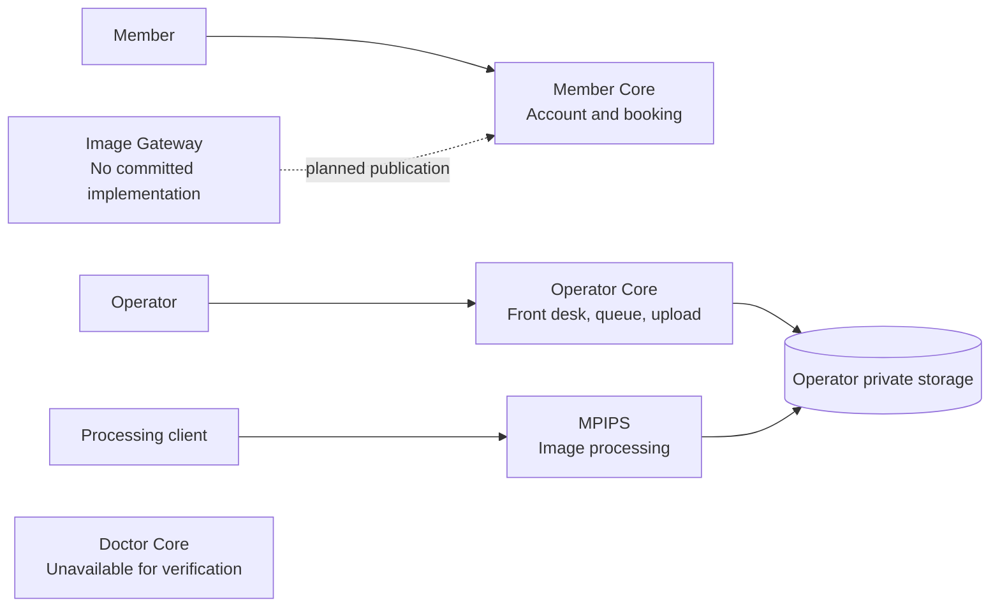
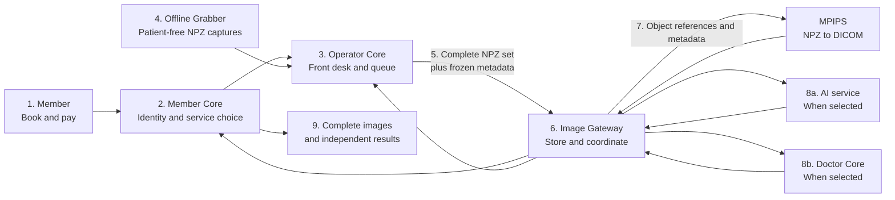

# Member Journey

This document separates verified current behavior from the approved target
journey. The target must not be presented as current production readiness.

## Current verified situation

The available applications contain useful foundations but are not connected
into the approved end-to-end flow.

### What exists today

1. **Member booking exists.** Member Core manages accounts, profiles,
   bookings, payments, and related member services.
2. **A limited operator bridge exists.** Member Core exposes controlled
   attendance and status capabilities, but their use by Operator Core was not
   verified.
3. **Examination-day operations exist separately.** Operator Core manages
   projects, participants, arrivals, queues, examinations, uploads, and
   completion.
4. **Operator Core accepts NPZ and DICOM extensions.** Files are stored in
   private S3-compatible storage, but the current record and preview paths are
   still DICOM-oriented and do not represent the approved multi-capture
   submission model.
5. **Image Gateway is not implemented in the available checkout.**
6. **MPIPS processing exists separately.** Its repository contains API,
   workers, storage support, and NPZ radiography workflow code. The exact
   Image Gateway-to-MPIPS NPZ production contract was not verified.
7. **Member Core can receive result metadata.** The sending Image Gateway is
   not implemented.
8. **Doctor Core is unknown.** Its repository was unavailable.

## Approved target journey

### Intended steps

1. **Register, choose, and pay.** The member selects AI-only, doctor-only, or
   both according to the service catalogue and completes payment.
2. **Prepare attendance.** Operator Core receives the authorised attendance
   and examination list from Member Core.
3. **Handle walk-ins.** A walk-in must be registered in Member Core, receive a
   globally unique medical-record ID, and complete payment before Operator Core
   confirms the examination.
4. **Queue.** Front desk confirms arrival, and staff call one active
   examination at a time.
5. **Capture.** Offline Grabber produces one or more patient-free NPZ files.
6. **Review the draft set.** The operator uploads the files into the selected
   active examination. Incorrect captures may be removed and retaken.
7. **Submit once.** The operator clicks Submit for every NPZ remaining in the
   complete draft set.
8. **Accept.** Operator Core sends the capture set and frozen
   member/examination snapshot to Image Gateway. Durable gateway acceptance
   closes the operator queue item.
9. **Convert.** MPIPS creates DICOM for every submitted capture.
10. **Retry failures.** Image Gateway preserves successful results and retries
    only a failed capture, for up to three total attempts.
11. **Complete the image set.** The examination is image-complete only when
    every submitted capture has successfully produced DICOM.
12. **Make operator payment eligible.** Image Gateway notifies Operator Core
    only after the complete DICOM set succeeds.
13. **Route selected services.** AI and/or doctor work starts according to the
    booked service.
14. **Deliver independently.** The complete image set becomes visible without
    waiting for AI or doctor results. AI and doctor results become visible
    independently when each finishes.

## Multi-capture failure behavior

Every submitted capture is part of the examination.

If one capture fails:

- successful sibling DICOM files are preserved;
- only the failed capture is retried;
- the member does not see an incomplete image set;
- operator payment is not yet eligible; and
- after the third failed attempt, an administrator receives an email.

Telegram administrator notification is a later enhancement.

## Image and result access

### Member

- Views the complete processed image set.
- Exports TIFF, JPG, or PDF.
- Does not download raw DICOM or access raw NPZ.
- Receives AI and doctor results automatically when selected and complete.

### Operator

- Sees processing status and the complete processed image set.
- Does not see AI diagnoses or doctor reports.
- Does not download raw DICOM or access raw NPZ.

### Doctor

- Views the study in Doctor Core.
- May explicitly download raw DICOM through a short-lived, audited link when
  clinically necessary.
- Never accesses raw NPZ.
- May see available AI output but does not wait for it.

## Doctor report journey

1. Eligible studies enter a shared doctor queue.
2. A doctor claims a study, or later releases it.
3. An administrator may reassign it.
4. The doctor edits a draft report.
5. Submit finalises the report, makes doctor payment eligible, and starts
   automatic member publication.
6. The submitted report is immutable.
7. A clinically necessary amendment may be issued at any later time.
8. The amendment preserves the original and records its reason, doctor,
   timestamp, and signature.
9. The member receives the corrected version and a notification.

An amendment does not create an additional doctor payment.

## AI and doctor relationship

AI and doctor review are separate products:

- AI does not require doctor approval before publication.
- A doctor report does not wait for AI.
- A successful AI result is final for the current scope and is not rerun.
- Automatic retry applies to failed execution, not to successful AI output.
- Failure in one selected branch does not block a successful result from the
  other.

## Examination identity and FHIR

Member Core owns a globally unique medical-record ID used across all MHCS
organisations.

NPZ remains patient-free. The clinical identity used to create DICOM comes
from the frozen submission snapshot.

Patient, examination, imaging-study, and report information should use
FHIR-compatible structures. Queues, payments, retries, and administration use
ordinary application contracts.

SATUSEHAT integration remains a future possibility. Compatibility must not be
presented as integration or compliance.

## How to recognise target completion

The target journey is complete only when an authorised multi-capture test
examination can move from booking to image and selected-result publication
without:

- staff re-entering or inferring patient identity from filenames;
- uncontrolled file transfer;
- duplicate permanent clinical-file copies;
- lost processing or report-version status;
- exposure of raw NPZ to end users; or
- payment becoming eligible before its approved business trigger.
