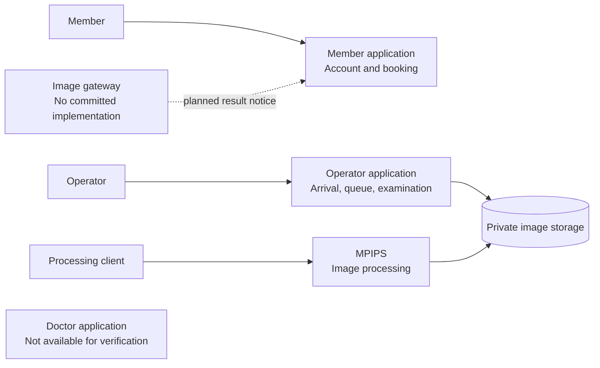
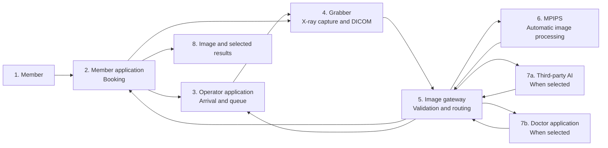

# Member Journey

This document separates what is available today from the intended
end-to-end service. The target journey must not be treated as a statement of
current production readiness.

## Current verified situation

The available applications have useful capabilities, but they do not yet form
one connected member journey.

### What happens today

1. **Member booking is available.** The member application manages accounts,
   profiles, booking, and related member services.
2. **A limited bridge is available but not connected.** The member application
   offers a controlled way for an operator system to read today's confirmed
   bookings and update their status. No use of that bridge was found in the
   available operator application.
3. **Examination-day operations are available separately.** The operator
   application manages projects, participants, arrivals, queues, examinations,
   and completion.
4. **Images are stored directly by the operator application.** The current
   operator workflow uploads captured files to private, S3-compatible storage
   and marks completed examinations as waiting for AI.
5. **The gateway connection is not available.** The image-gateway checkout has
   no committed application code.
6. **Image processing is available separately.** MPIPS can accept queued image
   jobs, process them, store outputs, and report job status, but no connection
   from operator-core or image-gateway was verified.
7. **The member application is ready to receive a publication notice.** It can
   store result information sent by an authorised image gateway and notify a
   member when the status is published. The sending gateway is not yet
   implemented in the available checkout.
8. **Doctor workflow is unknown.** Doctor-core was not available for
   inspection.

## Target member journey

The intended flow connects the five applications while keeping each
responsibility focused.

### Intended steps

1. **Book and choose:** The member pays during booking and selects AI diagnosis
   only, doctor review only, or both. Image processing is automatic for every
   option.
2. **Prepare arrivals:** Operator-core requests the expected attendance list
   from member-core.
3. **Handle walk-ins:** Front desk may register a new walk-in member. One
   configurable global limit applies across all operators, locations, and
   devices, resets daily, and consumes normal booking capacity.
4. **Queue:** Staff confirm arrivals and serve members in arrival order.
5. **Capture:** In the examination room, the operator uses Grabber. Grabber
   obtains authorised member information from member-core, creates the DICOM,
   and uploads it to image-gateway.
6. **Accept and process:** Image-gateway validates the DICOM. Acceptance makes
   the operator payment eligible. MPIPS processing starts automatically.
7. **Route selected services:** Image-gateway requests third-party AI diagnosis
   and/or doctor review according to the booking choice.
8. **Deliver independently:** The member receives the processed image and each
   completed selected result immediately. When both were selected, neither
   result waits for the other.
9. **Inform operations:** Operator-core receives processing completion status
   and may show the processed image, but it does not receive AI diagnosis or
   doctor-report details.

## Doctor and AI relationship

Doctor review and AI output are separate branches.

This means:

- AI does not replace the doctor workflow.
- Members explicitly choose AI only, doctor only, or both.
- The doctor may see AI output when it is available.
- The doctor may complete a review before AI finishes.
- Each successful result is delivered as soon as it is ready.
- A successful result is still delivered if the other selected service fails.

The third-party AI must retry failures a limited number of times. The exact
retry count is still **Unknown**. After the final failure, an administrator is
notified so the provider can be contacted. Downstream AI failure does not
cancel operator payment.

## Examination identity

The target flow uses a medical-record identifier rather than NIK as the
primary examination link. Its exact format and mapping have not been decided.
Any future SATUSEHAT compatibility would require a separately approved mapping:
no SATUSEHAT integration, mapping, or compliance has been implemented or
verified. See [SATUSEHAT readiness](04-satusehat-readiness.md).

## What must be connected

The target journey requires agreed handoffs for:

- a booking moving from member operations to examination-day operations;
- member data moving safely from member-core to Grabber;
- an examination and its image moving to the image gateway;
- processing requests and status updates between the gateway and MPIPS;
- optional AI requests and outputs;
- doctor work assignments and review outputs; and
- processed images and selected results returning to the member application;
- completion-only status returning to operator-core; and
- gateway acceptance making operator payment eligible.

These are business handoffs. Their technical contracts are outside this
overview pack. SATUSEHAT is not part of this current or approved target journey;
it remains a separate future possibility.

## How to recognise completion

The target journey is not complete merely because every application exists.
It is complete only when one authorised test case can move from booking to
publication without staff re-entering identifiers, moving files through an
uncontrolled channel, or losing its status between applications.
