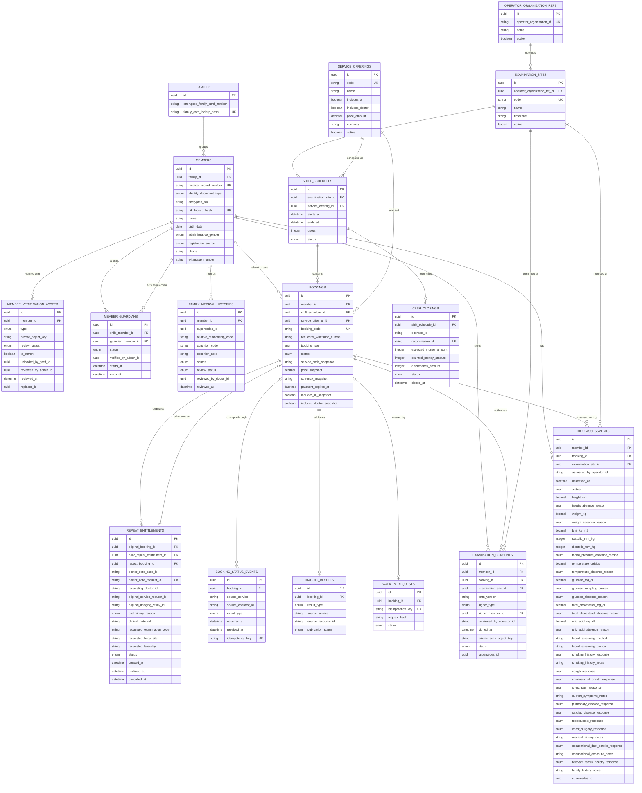

# MHCS Core Member Module Specification

**Specification status:** Expected end-state specification
**Business foundation:** Candidate — pending human approval
**Last reviewed:** 29 August 2026

This is the Member module specification for the approved `mhcs-core` modular
application. It defines the expected state that creation and implementation
work must move toward. The overall runtime and repository boundary is defined
by the [MHCS Core architecture](../../project.md).

## Business Traceability

This module is the technical authority for [Member stories](../../../../business/02-user-stories.md#member) and the Member Core responsibilities in [System Responsibilities](../../../../business/03-system-responsibilities.md#member-core): booking and relationship roles, approved attendance/identity handoff, Messaging notifications, optional doctor-review coordination, repeat entitlements, and temporary secure result-surface delivery.

## Agent rules

- Treat every requirement in this document as the expected state that the
  implementation must satisfy.
- When the implementation differs from this specification, adapt the
  implementation toward the specification. Do not weaken the specification to
  match existing code.
- Verify source and tests before claiming that a requirement is implemented.
- Do not invent database columns, operation inputs, states, or module
  ownership.
- Internal names do not have to match FHIR resource names. MHCS uses `Member`
  internally and maps it to FHIR `Patient` only at an external boundary.
- HL7 FHIR R5 `5.0.0` is the only active MHCS interoperability standard.

## Purpose and ownership

Member Core is the backend domain authority for:

- member healthcare identity and the globally unique MHCS medical-record number (MRN);
- member registration and demographics, including operator-assisted on-site walk-ins;
- conceptual separation of Requester/contact, Payer, Subject of care, Guardian, and Result recipient;
- examination sites, service offerings, schedules, and bookings;
- B2B and B2C booking authority and coordination via the WhatsApp channel;
- booking pricing snapshots, payment tracking, and financial reconciliation;
- the attendance list and booking locator queries supplied to Operator Core;
- WhatsApp-based member notifications; and
- WhatsApp notification followed, where appropriate, by secure temporary result-link
  delivery to a task-specific result web surface; this is not a persistent Member Portal.

Member Core does **not** provide an authenticated member web portal, native iOS/Android
apps, desktop applications, or member username/password credentials. WhatsApp is the
persistent Member interaction and orchestration channel; Members may open a secure
temporary result surface when required.

Member Core does not own front-desk queues, image capture, raw NPZ, permanent
DICOM storage, AI execution, doctor work queues, or operator/doctor earnings.

## Users and admin panel

- WhatsApp is the persistent Member interaction and orchestration channel; finalized results may open through a secure temporary result surface.
- Global Admin / Super Admin manages Member domain operations through the Unified Administration
  Panel (e.g. at `/admin`).
- The admin panel manages member records, service offerings, schedules, B2B and B2C
  bookings, payment statuses, promotions, and settings.
- Operator features use the authenticated MHCS Core staff user, role, and active
  site context. No separate member web login is required or supported.

## Identity and relationship model

MHCS models healthcare identity and relationship roles explicitly:

- `members` owns the healthcare identity, MRN, and clinical demographics.
- Member records are **not** linked to login credentials in a `users` table; members
  have no persistent conventional web account or login. Temporary result-surface
  authentication and session mechanics remain open.
- Operational roles are conceptually distinguished:
  - **Requester / contact:** the individual initiating WhatsApp communication;
  - **Payer:** the party funding the booking (enterprise customer for B2B, individual for B2C);
  - **Subject of care:** the patient who attends and receives clinical examination;
  - **Guardian:** the verified adult acting on behalf of a dependent child;
  - **Result recipient:** the authorized recipient of member-safe clinical results.

Identifiers have distinct purposes:

- `members.id`: internal member identifier used by MHCS relations;
- `members.medical_record_number`: immutable, globally unique MHCS MRN;
- `bookings.booking_code`: alphanumeric reservation locator received by the member via WhatsApp; and
- external patient identifiers: optional integration metadata, never used as the local primary key.

### Booking code vs. on-site official identity verification

A booking code received by a member is a reservation locator used for on-site lookup.
It is **not** sufficient proof of patient identity.

Official identity verification is a mandatory on-site TU workflow:

1. The patient presents the approved physical identity evidence required by the current verification procedure.
2. Reception / Registration Site Staff performs the approved minimum comparison against Member Core verification records.
3. Any face or photograph comparison occurs only if the approved procedure requires it.
4. Only after positive approved identity verification does the booking transition to `checked_in`; photo/face comparison is used only when required by the approved procedure.

### WhatsApp chat privacy

To protect member privacy and comply with healthcare data protection principles:

- Sensitive official identity documents (such as KTP/KIA/KK scans) are **never** requested, transmitted, or collected via ordinary WhatsApp chat.
- Identity document scans are captured and verified exclusively on-site at the TU station or via secure administrative verification procedures.

### Children and guardians

Registering a child requires the approved minimum evidence for the child and at
least one parent or legal guardian whose own verified record is linked. More than
one guardian may be linked after Global Admin / Super Admin verifies the approved evidence.
Every active guardian has equal access to coordinate the child's
bookings and receive member-safe results.

The child has no independent credentials. At the applicable age or legal-status
transition, the member presents the approved evidence for verification and activates
independent communication authority; guardian
coordination then ends automatically unless a separately verified legal authority
continues it.

## B2B and B2C operating model

Member Core supports B2B enterprise agreements and direct B2C bookings:

### Initial B2B provisioning

After a business agreement and its member data are available, an MHCS
developer or Global Admin / Super Admin provisions the agreed members, entitlements,
locations, dates, and shifts. Plaintext passwords are not generated or distributed
because members interact via WhatsApp without web credentials.

The Business Customer is the organization that funds the entitlements and defines
the agreed B2B scope. An Authorized B2B Representative is the human actor who may
provide or confirm that scope and request an authorized booking change for the
Business Customer; the representative does not gain authority beyond the agreement.

### Booking and payment rules

- The business centrally funds B2B bookings for covered members.
- The business determines the examination, service, location, date, and shift.
  A member cannot cancel or reschedule a B2B booking; only Global Admin / Super Admin
  acting on an official business request may do so.
- A B2B no-show remains paid and consumes the agreed examination quota.
- For B2C services, members coordinate bookings directly through WhatsApp.
- Financial transactions, pricing snapshots, and booking payment statuses are
  tracked with strict audit trails.

> [!NOTE]
> The legacy rule that Madeena Points is the exclusive member payment instrument
> is subject to reconciliation. Commercial policies regarding Madeena Points retirement,
> conversion to internal loyalty credits, direct-rupiah pricing, payment provider adapters,
> deposit versus full-payment requirements, and refund workflows remain explicitly open
> design decisions.

### B2C cancellation and postponement

- A Global Admin / Super Admin-configured cancellation cutoff applies to B2C bookings.
- A member may cancel before the cutoff via WhatsApp according to the configured
  refund policy.
- At or after the cutoff, member cancellation is rejected. A no-show forfeits
  booking fees because operator capacity has already been committed.
- If MHCS or the examination site cancels or postpones, the member receives
  full reimbursement or a rescheduled replacement.

### Family participation

Family members participate through B2C or family entitlements grouped by
protected KK data. KK household grouping is distinct from clinical family history.
A member may optionally report clinically relevant family history, which remains
labeled patient-reported until reviewed by an authorized doctor.

## Organization and examination-site rule

Every schedule and booking belongs to one examination site operated by an Operator Core
organization.

A site must not have overlapping active shift schedules. The authenticated Site Staff
session determines organization and active site, preventing cross-site attendance
leakage.

The Operator module owns the physical site record. The Member module owns
schedules and bookings referencing that shared site identity.

## MHCS Core topology

Member is a module in the single `mhcs-core` repository and runtime. It shares
the staff authentication foundation, database, queue, and deployment with Operator,
Doctor, and Image Gateway while retaining explicit table and business-rule
ownership.

Cross-module commands and queries are local application interfaces. Durable
domain events coordinate asynchronous follow-up.

## Required data model



### Schema requirements

- Member demographics and MRN belong to `members`. Members do not have login credentials or web accounts.
- An approved minimum identity identifier and any verification assets are private and purpose-bound; exact fields and storage mechanics remain open.
- `bookings.booking_code` is the unique alphanumeric reservation locator.
- Active schedules for one site cannot overlap.
- One member identity may have at most one active booking across all sites, shifts, and services.
- A doctor-requested repeat entitlement is zero-cost, doctor-only, linked to the original booking and study, and allows the member to choose any compatible site and shift via WhatsApp.
- Every booking preserves B2B or B2C authority and financial provenance.
- Booking status events retain source, occurrence time, receipt time, and idempotency key.
- Examination consent and basic examination assessments are timestamped history linked to member, booking, site, and responsible operator. Corrections create a new row through `supersedes_id`.

## Booking states

One member identity may have only one active booking across every site, shift,
and service. Active internal states are `pending_payment`, `confirmed`,
`arrived`, `checked_in`, `in_progress`, and `postponed`. Terminal states release
that identity for a new booking.

```text
pending_payment -> confirmed -> arrived -> checked_in -> in_progress -> completed
        |              |           |            |
        |              |           |            +--------------------> cancelled
        |              |           +---------------------------------> cancelled
        |              +---------------------------------------------> no_show
        |              +---------------------------------------------> postponed
        |              +---------------------------------------------> cancelled_refunded
        +------------------------------------------------------------> payment_expired
```

The operational mapping to FHIR R5 is:

| Internal booking state | FHIR R5 `Appointment.status` |
|---|---|
| `confirmed` | `booked` |
| `arrived` | `arrived` |
| `checked_in` | `checked-in` |
| `in_progress`, `completed` | `fulfilled` |
| `no_show` | `noshow` |
| cancelled state | `cancelled` |

Member Core automatically changes a still-`confirmed` booking to `no_show`
exactly at shift `ends_at`. If arrival occurred before shift end but sync was
delayed, the occurrence time corrects the status with an audit trail.

A paid booking becomes `confirmed`, publishes its `Appointment` as `booked`,
and creates its imaging `ServiceRequest`.

## Doctor-requested repeat entitlement contract

The Doctor module invokes one local, idempotent `CreateRepeatEntitlement` command
identifying the original case, booking, `ServiceRequest`, examination, `ImagingStudy`,
requesting doctor, controlled preliminary reason (`operator_error`, `equipment_failure`,
`incorrect_order`, `medical_limitation`, `other`), occurrence time, source version,
and any corrected order details.

Member Core atomically creates:

- one zero-cost entitlement with no automatic expiry;
- one doctor-only service snapshot with AI disabled; and
- one linked replacement `ServiceRequest`.

The command and Doctor module's 25% repeat-assessment earning commit atomically.
Member Core coordinates repeat scheduling with the member via WhatsApp.

## Operator attendance and lookup application contract

The Operator module queries Member Core for eligible attendance:

- `at` timestamp is normalized to UTC.
- Authenticated Site Staff session determines organization and active site.
- Returns confirmed, paid, non-cancelled bookings for the schedule.
- The attendance list exposes only masked NIK and booking code.
- Reception / Registration Site Staff may enter the booking code and the minimum additional identifier permitted by the approved verification procedure.
- Email, phone, address, and financial details are not exposed to Site Staff.
- Every lookup is audited with operator, booking, site, and purpose.

## Operator-assisted walk-in application contract

Site Staff holding the Reception / Registration role creates a walk-in through
one idempotent application operation:

1. Match an existing member by exact protected NIK.
2. Reuse existing member or capture only the approved minimum identity evidence and verification assets to create `members`.
3. Assign immutable MRN for a new member.
4. Record cash or on-site payment tracking.
5. Create confirmed walk-in booking and `ServiceRequest`.
6. Produce booking locator, MRN, and receipt.
7. Post-commit handler appends member to the Operator site queue.

No member login credentials or temporary passwords are created.

## Arrival identity verification

At the TU station:

1. Patient presents the booking code and the approved identity evidence required by the current procedure.
2. Reception / Registration Site Staff opens the short-lived verification view.
3. Reception / Registration Site Staff applies the approved minimum comparison using protected Member Core records.
4. Positive match changes booking to `checked_in`.
5. Mismatch blocks queue entry and opens an administrative exception.

## Examination consent record

Informed consent is confirmed on paper strictly once per visit at front-desk check-in.
Before ticket issuance, Member Core records the consent form version, signer, signature
confirmation, signing time, responsible operator, site, booking, and required private scan.
Downstream stations reuse this visit consent confirmation.

## Operator cash-closing application contract

After ending operational work, the Operator module submits counted cash.
Member Core compares it against expected cash from on-site collections and returns
`reconciled` or `reconciliation_required`.

## Basic examination & vital signs assessment

Operator Core records basic measurements. Member Core is the authoritative
longitudinal store:

| Measurement | LOINC code | Canonical UCUM unit |
|---|---:|---|
| Height | `8302-2` | `cm` |
| Weight | `29463-7` | `kg` |
| Body mass index | `39156-5` | `kg/m2` |
| Blood-pressure panel | `85354-9` | components |
| Systolic pressure | `8480-6` | `mm[Hg]` |
| Diastolic pressure | `8462-4` | `mm[Hg]` |
| Body temperature | `8310-5` | `Cel` |

Point-of-care blood screening covers glucose, total cholesterol, and uric acid as
laboratory measurements. Structured interview captures smoking, symptoms, disease
history, occupational exposure, and family history.

## Security and privacy invariants

- Staff access is derived from authenticated user, role, permissions, and active site.
- Members do not have login credentials or passwords.
- Official identity documents (KTP/KIA/KK) use private object storage with opaque keys and are never collected via ordinary WhatsApp chat.
- Raw NPZ and DICOM never pass through Member Core.
- Results are announced through WhatsApp and may be viewed/downloaded through a secure
  temporary result surface; exact mechanics remain open.

## FHIR R5 boundary

- **FHIR release:** R5 `5.0.0` only.
- Mappings:
  - `Member` -> `Patient`
  - Verified guardian -> `RelatedPerson`
  - Relative clinical history -> `FamilyMemberHistory`
  - Consent -> `Consent`
  - Booking -> `Appointment`
  - Performed visit -> `Encounter`
  - Examination order -> `ServiceRequest`
  - Health measurements -> `Observation`
  - Doctor report -> `DiagnosticReport`

## Admin panel

Global Admin / Super Admin manages Member operations via the Unified Administration Panel:

- member identity reconciliation;
- protected NIK/KK reconciliation, verification assets, and guardian verification;
- B2B agreements, member provisioning, and audited booking changes;
- service offerings, pricing, AI/doctor inclusion flags;
- site schedules, quotas, and booking eligibility;
- doctor-requested repeat entitlements and decline handling;
- cancellation cutoffs and payment deadlines; and
- cash-closing reconciliation.

## Acceptance criteria

Member Core satisfies this specification when:

- [ ] Messaging is the persistent Member interaction layer; richer result viewing may use a secure temporary web surface without portal or password login requirements.
- [ ] Member records are created without requiring `users` login account linkages.
- [ ] Conceptual separation of Requester, Payer, Subject of care, Guardian, and Result recipient is maintained.
- [ ] Booking code functions as a reservation locator and does not bypass on-site official identity verification.
- [ ] On-site TU check-in verifies approved identity evidence and required comparison before changing booking to `checked_in`.
- [ ] No sensitive identity documents are requested or collected via WhatsApp chat.
- [ ] Repeat entitlements create zero-cost, doctor-only bookings coordinated via WhatsApp.
- [ ] Walk-in creation completes registration, booking, and order without generating member passwords.
- [ ] Attendance queries return masked NIK and booking code scoped strictly to the active site and shift.
- [ ] Ticket issuance requires valid signed paper consent confirmation and private scan.
- [ ] Longitudinal health measurements and structured interview responses are preserved with correction lineage.
- [ ] Mapped FHIR R5 resources validate against R5 `5.0.0` specifications.

## Open design decisions

The following decisions are intentionally unresolved by current human authority:

1. **WhatsApp Business Platform Provider:** Exact WhatsApp Business Platform provider, API gateway, integration contract, and hosting model.
2. **WhatsApp Bot / LLM Architecture:** Exact conversation flow design, NLP/LLM orchestration layer, automated triage logic, and human-handoff escalation boundaries.
3. **Payment Provider Integration:** Exact payment gateway adapter, payment methods (QRIS, VA, e-wallet), webhook schemas, and timeout/settlement contracts.
4. **Madeena Points Commercial Policy:** Final commercial determination whether Madeena Points are retired, converted to internal loyalty/subsidy credits, or replaced by direct rupiah pricing.
5. **Deposit vs. Full-Payment Policy:** Commercial rules regarding whether WhatsApp bookings require full advance payment, a deposit, or pay-at-site options.
6. **Cancellation & Refund Commercial Terms:** Specific cancellation cutoffs, refund fee policies, and automated refund settlement workflows for WhatsApp-originated bookings.
7. **Clinical Result Delivery Channel Mechanics:** Exact secure temporary result-link,
   session/authentication, disclosure, retention, and fallback mechanics; the result
   surface must remain task-specific and must not become a persistent Member Portal.
8. **On-Site Identity Verification Procedure:** Exact permitted evidence, comparison method, data minimization, retention, and storage mechanics at the TU station.
9. **FHIR R5 Conformance Artifacts:** Canonical URLs, package IDs, profiles, and validator fixtures.

## Standards references

- [HL7 FHIR R5 `5.0.0`](https://hl7.org/fhir/R5/)
- [HL7 FHIR R5 Vital Signs](https://hl7.org/fhir/R5/observation-vitalsigns.html)
- [HL7 FHIR R5 Patient](https://hl7.org/fhir/R5/patient.html)
- [HL7 FHIR R5 RelatedPerson](https://hl7.org/fhir/R5/relatedperson.html)
- [HL7 FHIR R5 FamilyMemberHistory](https://hl7.org/fhir/R5/familymemberhistory.html)
- [HL7 FHIR R5 Appointment](https://hl7.org/fhir/R5/appointment.html)
- [HL7 FHIR R5 ServiceRequest](https://hl7.org/fhir/R5/servicerequest.html)
- [HL7 FHIR R5 ImagingStudy](https://hl7.org/fhir/R5/imagingstudy.html)
- [HL7 FHIR R5 DiagnosticReport](https://hl7.org/fhir/R5/diagnosticreport.html)
- [HL7 FHIR R5 Encounter](https://hl7.org/fhir/R5/encounter.html)
- [HL7 FHIR R5 Provenance](https://hl7.org/fhir/R5/provenance.html)
- [HL7 FHIR R5 AuditEvent](https://hl7.org/fhir/R5/auditevent.html)
- [HL7 FHIR R5 Consent](https://hl7.org/fhir/R5/consent.html)
