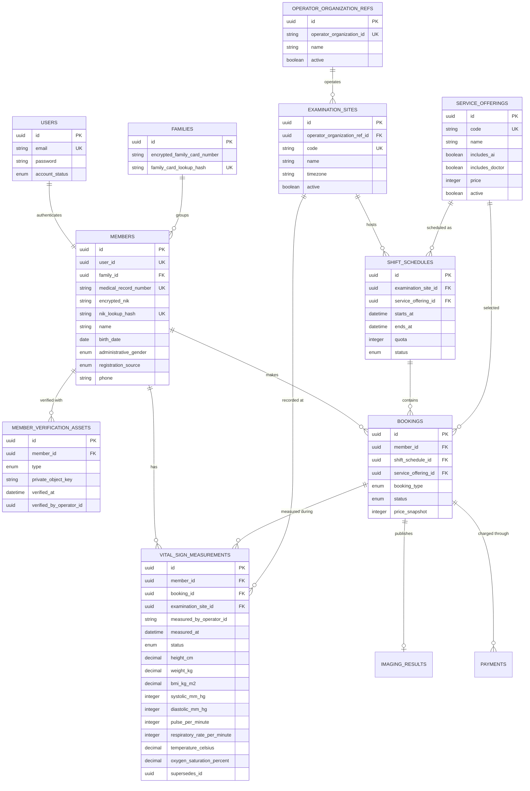

# Member Core Project Specification

**Specification status:** Working technical draft
**Business foundation:** Approved
**Last reviewed:** 22 July 2026
**Current implementation evidence:** `/var/www/mhcs-member-core` at
`452b1264fa6a2ddf0f5d1d92224db09b33677d6f`

This is the central specification for `mhcs-member-core`. After approval, a
repository-local copy will replace that repository's
`.agents/context/project.md`.

## Agent rules

- **CURRENT** means verified in the implementation checkpoint above.
- **TARGET** means required behavior approved in this specification.
- **GAP** means work is required; never describe it as implemented.
- Do not invent database columns, API fields, states, or service ownership.
- Internal names do not have to match FHIR resource names. MHCS uses `Member`
  internally and maps it to FHIR `Patient` only at an external boundary.
- HL7 FHIR R5 `5.0.0` is the only active MHCS interoperability target.
- Reverify current source before implementation if its Git checkpoint differs
  from the checkpoint above.

## Purpose and ownership

Member Core is the member-facing application and the authority for:

- login accounts created for members, including members without phones;
- member identity and the MHCS medical-record number;
- member registration, including operator-assisted walk-ins;
- examination sites, service offerings, schedules, and bookings;
- member charges, payments, points, and refunds;
- the attendance list supplied to Operator Core;
- member notifications; and
- member-safe presentation of processed images, AI results, and doctor reports.

Member Core does not own front-desk queues, image capture, raw NPZ, permanent
DICOM storage, AI execution, doctor work queues, or operator/doctor earnings.

## Users and admin panel

- Members use the member-facing Blade application.
- Member administrators use the Filament panel at `/admin`.
- The admin panel manages members, examination sites, service offerings,
  schedules, bookings, member payments, points, promotions, settings, and
  service credentials.
- Operator Core uses an organization/site-scoped service credential. It never
  receives direct database access.

**CURRENT:** A Filament panel exists at `/admin` and is restricted to verified
users with the `Super Admin` role. Resources exist for members, bookings,
services, schedules, shift templates, and promotions.

**GAP:** Examination-site management and scoped Operator Core credentials are
not represented in the current admin resources.

## Identity model

MHCS uses two records created through one member-registration operation:

- `users` owns authentication credentials and login state.
- `members` owns the healthcare identity and member demographics.

Every member, including a walk-in, receives both records. Keeping them separate
prevents authentication concerns from becoming the clinical identity model.
The business and UI term remains **Member** even when an external integration
maps the record to FHIR `Patient`.

A member logs in with either email and password or NIK and password. Email and
phone are optional because the target population includes people who have
neither. Authentication must use one generic `identifier` input and a generic
failure response so the login form does not reveal whether an email or NIK is
registered.

Identifiers have distinct purposes:

- `users.id`: internal authentication identifier;
- `members.id`: internal member identifier used by MHCS relations;
- `members.medical_record_number`: immutable, globally unique MHCS MRN; and
- external patient identifiers: optional integration metadata, never used as
  the local primary key.

NIK is an optional official identifier, not the primary key. A member without
NIK must not be assigned an invented NIK.

NIK and family-card number are sensitive lookup values. The target stores an
encrypted value for authorized display and a keyed lookup hash for exact match,
uniqueness, and login. They must not appear in logs, URLs, analytics, or API
responses unless the receiving role and purpose explicitly require them.

## Organization and examination-site rule

Every schedule and booking belongs to one examination site. Each site is
assigned to one Operator Core organization.

For the first API version, an Operator Core service credential is bound to one
organization and one site. The caller cannot select another organization or
site through request parameters. This prevents cross-site attendance leakage.

Member Core owns the bookable site record. Operator Core owns its operational
organization record. Their stable external identifiers are stored as opaque
references; there are no cross-service database foreign keys.

## Target data model



The diagram defines the required ownership and relations, not final Laravel
migration syntax. Supporting framework tables are omitted.

### Current schema

**CURRENT:** `users` currently combines authentication, member identity,
member lifecycle, points, and walk-in origin. `services`, `shift_templates`,
`shift_schedules`, `bookings`, `payments`, `point_transactions`, `referrals`,
`imaging_results`, `settings`, notifications, roles, and Sanctum tokens exist.

`shift_schedules` currently has no examination site. `bookings` relates
directly to `users`, and `user_type` mixes registration source (`walk_in`) with
account state (`member_pending`, `member_active`, `member_suspended`).

### Required schema changes

**TARGET:**

- Split member demographics and MRN into `members`, linked one-to-one to
  `users`.
- Allow a nullable email and authenticate by normalized email or NIK.
- Replace mixed `user_type` meaning with independent account status and member
  registration source.
- Add a family record keyed by protected KK number and associate members with
  it; KK is not a login identifier.
- Store KTP and profile photos as private verification assets, never public
  URLs or inline database blobs.
- Add Operator organization references and examination sites.
- Attach every shift schedule and booking to one site.
- Represent whether a service includes AI, doctor review, or both.
- Preserve price and selected-service behavior as immutable booking snapshots.
- Use stable UUIDs for identifiers exchanged between services.
- Preserve bookings and clinical history when login access is suspended.
- Store basic health measurements as timestamped history linked to the member,
  booking, site, and recorder; never overwrite a `members` table column with
  the latest value.

**GAP:** None of these target schema changes is implemented at the verified
checkpoint.

## Account and member states

Account state controls login only:

```text
pending_activation -> active -> suspended
                         ^          |
                         +----------+
```

Registration source is immutable metadata:

```text
online | walk_in | administrator
```

It must never be used as an account state.

## Booking states

The approved booking lifecycle is:

```text
pending_payment -> confirmed -> completed
        |              |       -> no_show
        |              |       -> postponed
        |              +------ -> cancelled_refunded
        +--------------------- -> cancelled
```

Exact cancellation and forfeiture transitions still require business approval.
Until decided, an agent must preserve existing behavior and report the gap.

## Operator attendance API

Operator Core obtains the eligible attendance list from Member Core. Member
Core never pushes member rows directly into the Operator Core database.

```http
GET /api/v1/operator/attendance?at=2026-07-22T09:15:00+07:00
Authorization: Bearer <site-scoped-token>
Accept: application/json
```

Rules:

- `at` is required, ISO 8601 with an explicit offset, and normalized to UTC.
- The authenticated credential determines the organization and site.
- Only confirmed, paid, non-cancelled bookings whose schedule contains `at`
  are returned.
- Repeating the request has no side effects.
- The response exposes only fields required for examination operations.
- Email, phone, address, account state, points, and payment details are not
  returned.

Target response:

```json
{
  "data": {
    "site_id": "site-uuid",
    "schedule_id": "schedule-uuid",
    "starts_at": "2026-07-22T02:00:00Z",
    "ends_at": "2026-07-22T05:00:00Z",
    "members": [
      {
        "booking_id": "booking-uuid",
        "member_id": "member-uuid",
        "medical_record_number": "MHCS-...",
        "name": "Member name",
        "birth_date": "1990-01-01",
        "administrative_gender": "female",
        "service_code": "THORAX-AI-DOCTOR",
        "attendance_status": "expected"
      }
    ]
  }
}
```

**CURRENT:** `GET /api/v1/operator/shifts/today` returns today's confirmed
shifts and bookings under a Sanctum `operator` ability. It uses Member Core's
server date, has no site scope, and exposes member email and phone.

**GAP:** Replace the current broad response with the approved site-scoped,
timestamp-based contract and implement its consumer in Operator Core.

## Operator-assisted walk-in API

An authenticated operator creates a walk-in through Member Core:

```http
POST /api/v1/operator/walk-ins
Authorization: Bearer <site-scoped-token>
Idempotency-Key: <unique-request-id>
Content-Type: application/json
```

The request supplies member identity, an activation contact, the selected
service offering, and the applicable schedule. The organization and site come
from the credential, not caller-controlled identifiers.

Member Core must perform one transaction:

1. Match an existing member using approved identifiers; never match by name
   alone.
2. Reuse the existing member or create `users` and `members` records.
3. Assign an immutable MHCS MRN when creating a member.
4. Create the walk-in booking.
5. Record payment state without letting Operator Core mutate wallet balances.
6. Return the member, MRN, and booking identifiers.
7. Send account activation outside the database transaction.

Operator staff never choose, receive, or view the member's password. Duplicate
requests with the same idempotency key must return the same result.

When a member has no email or phone, the registration interface must allow the
member to enter a password privately. An assisted fallback may use a printed
one-time secret that forces a password change; the secret must never be logged
or remain visible to staff after issuance.

The exact minimum walk-in identity fields and the login fallback for a member
without NIK, email, and phone remain open decisions and must be approved before
this endpoint is implemented.

## Arrival identity verification

Member Core stores two optional private verification assets:

- a KTP image, when the member has a KTP; and
- a current profile photograph.

Operator Core receives neither permanent object keys nor downloadable copies.
For a site-scoped eligible booking, an authorized operator may open a short-
lived verification view to compare the arriving person with the stored images.

Every view is audit logged with member, booking, operator, site, purpose, and
timestamp. The interface must prevent ordinary listing, bulk export, and public
caching. KTP access is limited to identity verification and reconciliation;
the less sensitive profile photograph should be preferred for routine arrival
checks after initial verification.

Collection purpose, member notice/consent or other lawful basis, retention,
replacement, and deletion rules require explicit policy approval before image
collection is enabled.

## Basic health measurements

Operator Core records basic measurements during arrival or examination. Member
Core is the authoritative longitudinal store. A current value is derived from
the newest valid measurement; it is not duplicated onto `members`.

The initial measurement set follows the FHIR R5 Vital Signs profile:

| Measurement | LOINC code | Canonical UCUM unit |
|---|---:|---|
| Height | `8302-2` | `cm` |
| Weight | `29463-7` | `kg` |
| Body mass index | `39156-5` | `kg/m2` |
| Blood-pressure panel | `85354-9` | components |
| Systolic pressure | `8480-6` | `mm[Hg]` |
| Diastolic pressure | `8462-4` | `mm[Hg]` |
| Pulse/heart rate | `8867-4` | `/min` |
| Respiratory rate | `9279-1` | `/min` |
| Body temperature | `8310-5` | `Cel` |
| Oxygen saturation | `2708-6` | `%` |

Each measurement set records:

- member, booking, examination site, and operator reference;
- actual measurement time separately from database creation time;
- status: `preliminary`, `final`, `corrected`, or `entered_in_error`;
- canonical numeric values and units;
- optional method, device, body site/position, cuff size, and notes when they
  materially affect interpretation; and
- correction lineage through `supersedes_id` instead of silent overwrite.

Blood pressure is one composite observation. Systolic and diastolic components
must be recorded together, or the missing component must carry a standardized
absence reason. BMI is calculated only from height and weight in the same
measurement session:

```text
BMI = weight_kg / (height_cm / 100)^2
```

Do not reject a measurement merely because it is clinically abnormal. Reject
invalid types or impossible units; require the operator to confirm implausible
values and retain that confirmation for audit.

### Operator measurement API

```http
POST /api/v1/operator/bookings/{booking}/vital-signs
Authorization: Bearer <site-scoped-token>
Idempotency-Key: <unique-measurement-request-id>
Content-Type: application/json
```

```json
{
  "measured_at": "2026-07-22T09:20:00+07:00",
  "status": "final",
  "height_cm": 168.5,
  "weight_kg": 62.4,
  "systolic_mm_hg": 118,
  "diastolic_mm_hg": 76,
  "pulse_per_minute": 72,
  "respiratory_rate_per_minute": 16,
  "temperature_celsius": 36.6,
  "oxygen_saturation_percent": 98
}
```

Rules:

- The booking must belong to the caller's credential-bound site.
- The API calculates BMI; callers cannot provide a conflicting BMI.
- At least one supported measurement is required.
- Duplicate idempotency keys return the original result.
- Corrections create a new record referencing the superseded record.
- Timestamps require an explicit offset and are normalized to UTC.

**CURRENT:** No vital-sign history or Operator Core measurement API exists at
the verified checkpoint.

**GAP:** Implement the target storage, scoped API, audit history, and FHIR
mapping before claiming structured vital-sign support.

## Security and privacy invariants

- Service credentials are stored hashed, scoped to one site, revocable, and
  never committed as plaintext.
- Passwords are hashed with the framework's approved adaptive password hasher;
  NIK and KK lookup hashes are keyed and separate from encrypted display values.
- Login is rate limited and returns the same failure response for an unknown
  identifier and an incorrect password.
- Every cross-service request is authenticated and audit logged.
- Member information is minimized for the operator's task.
- KTP and profile photographs use private encrypted object storage and
  short-lived authorized access; they are never placed in a public bucket.
- Suspended login access does not erase the member or medical history.
- Raw NPZ and DICOM never pass through Member Core.
- Result URLs are short-lived or resolved through an authorized proxy.
- Database transactions and row locks protect booking quotas, points, and
  idempotent walk-in creation.

## FHIR R5 boundary

### Version and conformance policy

- **FHIR release:** R5 `5.0.0` only.
- **FHIR endpoint base:** `/fhir/r5`.
- **FHIR JSON media type:** `application/fhir+json; fhirVersion=5.0`.
- **MHCS operational APIs:** ordinary versioned MHCS JSON contracts. They must
  not claim FHIR conformance because their field names resemble a resource.
- **Profiles:** the approved MHCS R5 Implementation Guide and resource profiles
  take precedence over unconstrained base-resource examples.
- **Future adapters:** a future integration with an older release must use a
  separate explicit adapter and must not weaken the R5 source model.

`GET /fhir/r5/metadata` returns the Member Core `CapabilityStatement`. Every
FHIR resource declares its MHCS profile through `meta.profile`. Unsupported
resources, interactions, searches, or profiles return `OperationOutcome` and
are never accepted as loosely structured JSON.

Member Core initially supports the R5 resources it owns:

| Resource | Required capability |
|---|---|
| `Patient` | read, search, create, update, history |
| `RelatedPerson` | read/search when a family member participates in care |
| `FamilyMemberHistory` | read/search/create/update for recorded family history |
| `Schedule`, `Slot` | read/search for bookable availability |
| `Appointment` | read/search/create/update for member bookings |
| `ServiceRequest` | read/search/create/update for imaging orders |
| `Observation` | read/search/create and correction history for vital signs |
| `Consent` | read/search/create/update for applicable permissions |
| `DocumentReference` | read/search for member-safe documents |
| `Provenance`, `AuditEvent` | authorized read/search only |
| `Bundle`, `OperationOutcome` | transaction/search results and standard errors |

The `CapabilityStatement` is authoritative for the final interaction and
search list. This table is the minimum target, not evidence of implementation.

Internal names remain business-oriented:

| MHCS concept | External FHIR representation |
|---|---|
| Member | `Patient` |
| Operator/doctor | `Practitioner` |
| Staff assignment | `PractitionerRole` |
| Operator organization | `Organization` |
| Examination site | `Location` |
| Booking | `Appointment` |
| Performed examination | `Encounter` |
| Imaging examination order | `ServiceRequest` |
| Basic health measurement | `Observation` |
| Imaging study | `ImagingStudy` |
| Doctor report | `DiagnosticReport` |
| Report file or member-safe document | `DocumentReference` when needed |
| Resource revision lineage | `Provenance` |
| Security access record | `AuditEvent` |

This mapping is a boundary contract, not a direction to reproduce FHIR JSON as
the relational schema. Local tables use clear MHCS domain models and a mapper
builds or consumes FHIR resources.

The mapping table names stable domain concepts. Exact R5 element paths belong
in the MHCS profiles and mapper, not in UI code.

### Required radiology chain

The target radiology relationship is:

```text
Member/Patient
  -> booking/Appointment
  -> visit/Encounter
  -> imaging order/ServiceRequest
  -> DICOM study/ImagingStudy
  -> findings/Observation
  -> report/DiagnosticReport
```

Required linkage rules:

- `ServiceRequest` identifies the member, encounter, requested examination,
  body site/laterality, requester, performer organization, location, priority,
  reason, authored time, and accession/order identifiers.
- `ImagingStudy` references the same member, encounter, and `ServiceRequest`,
  plus location, modality, study/series/instance UIDs, start time, and available
  series/instance counts.
- `DiagnosticReport` references the same encounter and `ServiceRequest`, its
  `ImagingStudy`, result observations, interpreter, effective/issued times,
  conclusion, status, and any presented report form.
- A correction never overwrites a final clinical report. It creates a new
  version with explicit lineage and preserves the prior version.

MHCS R5 radiology uses `ServiceRequest`, `ImagingStudy`, `Observation`, and
`DiagnosticReport`. FHIR logical IDs, local UUIDs, accession numbers, and DICOM
UIDs remain distinct identifiers and must never be substituted for each other.

### Ownership of FHIR mappings

| Resource | MHCS source authority |
|---|---|
| `Patient` | Member Core |
| `Appointment` | Member Core, when required by the approved use case |
| `Encounter` | Operator Core, with the reference returned to Member Core |
| Vital-sign `Observation` | Member Core; Operator Core records it |
| `ServiceRequest` | Member Core creates the examination order |
| `ImagingStudy` | Image Gateway after DICOM creation/storage |
| AI result `Observation` | Image Gateway |
| `DiagnosticReport` | Doctor Core for doctor reports |
| `Organization`, `Location`, `PractitionerRole` | Owning service, reconciled with central identifiers |

Family membership is not automatically exported as FHIR `RelatedPerson`.
Create that relationship only when the person participates in the member's
care and the applicable exchange requires it.

### Integration metadata

Every synchronized local resource must retain:

- external system and FHIR resource type;
- FHIR release and profile canonical URL;
- external resource ID and version ID;
- local resource type and immutable local ID;
- synchronization status and last attempt time;
- successful synchronization time; and
- sanitized error code without clinical payload or credentials.

External failure never removes or silently changes the authoritative local
record. Retries are idempotent, and submitted payload versions remain
traceable.

### Terminology and units

Use standard terminology at clinical exchange boundaries:

| Purpose | Standard |
|---|---|
| Vital signs and coded measurements | LOINC |
| Measurement units | UCUM |
| Anatomy, laterality, and clinical concepts | SNOMED CT where required by the profile |
| Diagnoses or examination reasons | The ICD-10 edition approved by MHCS |
| DICOM modality and study/series/instance identity | DICOM identifiers and code sets |
| Dates and instants | ISO 8601 with explicit offset; canonical UTC exchange |

Local codes may exist for MHCS operations, but every externally exchanged code
requires a documented mapping. Do not reuse a display label as a code, invent
a LOINC/SNOMED code, or assume a code is valid because it exists in another
FHIR release.

### Conformance artifacts

The R5 interface requires these conformance artifacts; ordinary MHCS APIs do
not:

- `ImplementationGuide`: package and version the MHCS FHIR rules;
- `StructureDefinition`: constrain each supported R5 resource/profile;
- `CapabilityStatement`: declare supported resources, operations, searches,
  formats, and FHIR version;
- `ValueSet` and `CodeSystem`: only for genuinely local coded concepts not
  already covered by an approved terminology;
- `ConceptMap`: map genuinely local operational codes to approved R5 concepts;
- example resources and automated validation fixtures for valid, invalid, and
  version/profile mismatch cases.

Security and history are also standardized concerns: `Consent` represents an
applicable clinical consent record, `Provenance` records who or what produced a
resource version, and `AuditEvent` records security-relevant access. These
resources do not replace MHCS authorization checks or immutable local audit
logs.

FHIR R5 conformance is the approved target but is not implemented at the
verified checkpoint. Local entities remain authoritative for MHCS operations;
the R5 API is a strict interoperable representation with explicit profiles,
validation, history, and security.

## Admin-panel target

Member administrators must be able to manage:

- member identity reconciliation and account activation;
- protected NIK/KK reconciliation, family grouping, and verification assets;
- Operator organizations and examination sites;
- site-scoped service credentials and revocation;
- service offerings and AI/doctor inclusion flags;
- site schedules, quotas, and booking eligibility;
- bookings, payments, refunds, points, and promotions; and
- result publication state without access to raw clinical binaries.

Sensitive administrative actions require authorization and audit history.

## Acceptance criteria

The Member Core target is not complete until tests demonstrate that:

- an online registration creates linked user and member records;
- login works with email or NIK without requiring a phone;
- login errors do not disclose whether a NIK or email exists;
- an idempotent operator walk-in request creates at most one member and booking;
- a credential cannot retrieve attendance for another site;
- attendance excludes unpaid, cancelled, and out-of-window bookings;
- attendance does not expose unnecessary account/contact data;
- KTP/profile access is booking-, site-, role-, and audit-scoped;
- repeated health measurements preserve history and correction lineage;
- vital-sign values use the specified LOINC codes and UCUM units when mapped;
- blood pressure maps systolic and diastolic as one composite observation;
- cross-service, FHIR, and DICOM identifiers cannot be confused with local IDs;
- every external payload declares and validates against its intended FHIR
  release and profile;
- non-R5 or unversioned resources are rejected by the R5 interface;
- booking capacity remains correct under concurrent requests;
- account suspension preserves bookings and clinical references; and
- FHIR mapping uses the member identity without renaming the internal domain.

## Open decisions

- Which identity fields are mandatory when a walk-in has no NIK?
- May a member without NIK/email/phone log in with MRN and password?
- What are the approved KTP/profile-photo retention and deletion periods?
- What are the exact cancellation, refund, and forfeiture transitions?
- Is one service credential issued per deployed Operator Core instance or per
  site regardless of deployment?

## Standards references

- [HL7 FHIR R5](https://hl7.org/fhir/)
- [HL7 FHIR version management](https://hl7.org/fhir/versions.html)
- [HL7 FHIR R5 Vital Signs](https://hl7.org/fhir/observation-vitalsigns.html)
- [HL7 FHIR R5 ServiceRequest](https://hl7.org/fhir/servicerequest.html)
- [HL7 FHIR R5 ImagingStudy](https://hl7.org/fhir/imagingstudy.html)
- [HL7 FHIR R5 DiagnosticReport](https://hl7.org/fhir/diagnosticreport.html)
- [HL7 FHIR R5 Encounter](https://hl7.org/fhir/encounter.html)
- [HL7 FHIR R5 Provenance](https://hl7.org/fhir/provenance.html)
- [HL7 FHIR R5 AuditEvent](https://hl7.org/fhir/auditevent.html)
- [HL7 FHIR R5 Consent](https://hl7.org/fhir/consent.html)
