# Member Core Project Specification

**Specification status:** Expected end-state specification
**Business foundation:** Approved
**Last reviewed:** 23 July 2026

This is the central specification for `mhcs-member-core`. It defines how the
system must work and is the expected state that implementation work must move
toward. A repository-local copy will replace that repository's
`.agents/context/project.md`.

## Agent rules

- Treat every requirement in this document as the expected state that the
  implementation must satisfy.
- When the implementation differs from this specification, adapt the
  implementation toward the specification. Do not weaken the specification to
  match existing code.
- Verify source and tests before claiming that a requirement is implemented.
- Do not invent database columns, API fields, states, or service ownership.
- Internal names do not have to match FHIR resource names. MHCS uses `Member`
  internally and maps it to FHIR `Patient` only at an external boundary.
- HL7 FHIR R5 `5.0.0` is the only active MHCS interoperability standard.

## Purpose and ownership

Member Core is the member-facing application and the authority for:

- login accounts created for members, including members without phones;
- member identity and the MHCS medical-record number;
- member registration, including operator-assisted walk-ins;
- examination sites, service offerings, schedules, and bookings;
- B2B and B2C booking authority;
- member charges, payments, source-restricted Madeena Points, and refunds;
- the attendance list supplied to Operator Core;
- member notifications; and
- member-safe presentation of processed images, AI results, and doctor reports.

Member Core does not own front-desk queues, image capture, raw NPZ, permanent
DICOM storage, AI execution, doctor work queues, or operator/doctor earnings.

## Users and admin panel

- Members use the member-facing Blade application.
- Member administrators use the Filament panel at `/admin`.
- The admin panel manages members, examination sites, service offerings,
  schedules, B2B and B2C bookings, member payments, point reservations,
  promotions, settings, and service credentials.
- Operator Core uses an organization/site-scoped service credential. It never
  receives direct database access.

## Identity model

MHCS uses two records created through one member-registration operation:

- `users` owns authentication credentials and login state.
- `members` owns the healthcare identity and member demographics.

Every adult member, including a walk-in, receives both records. A child receives
a member record and a login-disabled user record; verified guardians act through
their own accounts until the child activates independent access at age 17.
Keeping authentication separate prevents login concerns from becoming the
clinical identity model. The business and UI term remains **Member** even when
the private FHIR boundary maps the record to `Patient`.

A member logs in with either email and password or NIK and password. Email and
phone are optional because the population includes people who have
neither. Authentication must use one generic `identifier` input and a generic
failure response so the login form does not reveal whether an email or NIK is
registered.

Identifiers have distinct purposes:

- `users.id`: internal authentication identifier;
- `members.id`: internal member identifier used by MHCS relations;
- `members.medical_record_number`: immutable, globally unique MHCS MRN; and
- external patient identifiers: optional integration metadata, never used as
  the local primary key.

NIK is a mandatory official identifier but not the primary key. Registration
requires an uploaded KTP for a member aged 17 or older, or a KIA for a child
under 17 and not married. Any exceptional identity-document eligibility follows
current Dukcapil rules. Every registration also requires a separate MHCS profile
photograph; a KIA for a child under five does not itself contain a face
photograph.

NIK and family-card number are sensitive lookup values. Member Core stores an
encrypted value for authorized display and a keyed lookup hash for exact match
and uniqueness; only NIK is also used for login. They must not appear in logs,
URLs, analytics, or API responses unless the receiving role and purpose
explicitly require them.

KK groups members into a family but is not a login identifier. A member who has
no email or phone may log in with NIK and password. If that member forgets the
password, an MHCS administrator performs assisted recovery after verifying the
member's identity document, face, and KK where applicable; the flow must not
disclose protected values or account existence to an unauthorised requester.

### Children and guardians

Registering a child requires the child's KIA, profile photograph, KK, and at
least one parent or legal guardian whose own MHCS account and KTP have already
been verified. More than one guardian may be linked after an administrator
verifies the KTP, KIA, and KK evidence. Every active guardian has equal access
to the child's bookings, points, and member-safe results.

A guardian always logs in to their own account and selects the child's dependent
profile. The guardian never uses or receives child credentials, and every action
is attributed to the acting guardian. The child has no independent login until
age 17. At age 17, the member verifies a KTP and activates independent access;
guardian access then ends automatically unless a separately verified legal
authority continues it. Activation, guardian additions and removals, and every
exception are audited.

## B2B-first commercial model

Member Core supports B2B and B2C simultaneously through the same member
account and individual wallet. B2B is the initial commercial priority.

### Initial B2B provisioning

After a business agreement and its member data are available, an MHCS
developer will use a later manual import script. The import creates or matches
members, allocates the agreed annual Madeena Points, and creates the agreed
entitlements and any bookings whose schedules are already known. No import
script or fixed input format is specified before real agreement data are
available.

Each imported account receives a unique random temporary password generated
with a cryptographically secure source. The account is active but must force a
password change immediately after the first successful login. Plaintext
temporary passwords must not be logged or stored after the one-time handoff.
MHCS sends the credential document to one designated business contact outside
Member Core; credential-document delivery is not an application feature.

### Booking and points rules

- The business centrally pays the annual fee for each covered member. Its
  agreed value becomes business-funded Madeena Points in that member's
  individual wallet.
- Business-funded points are reserved for the agreed B2B entitlements or
  bookings and cannot pay for a personal B2C booking. When scheduling follows
  later, the reservation remains locked until its booking is created.
- The agreement must provision the complete B2B cost before its entitlement or
  booking is created. A funding mismatch is an administrative data error and
  must never take points from the member's personal balance.
- The business determines the examination, selected result service, location,
  date, and shift. A member cannot cancel or reschedule a B2B booking.
- An MHCS administrator may change or cancel a B2B booking only after an
  official request from the business, with the request and action audited.
- A B2B no-show remains paid and consumes the agreed examination quota.
  Employee attendance consequences belong to the business, not MHCS.
- A member may top up personal points and create additional B2C bookings in the
  same account. Personal points fund these member-controlled bookings.

The points ledger must preserve funding source, reservation, allocation, and
consumption history even though the member sees one wallet. Booking records
must preserve whether their authority and funding are B2B or B2C; changing a
label must never convert one type into the other.

Madeena Points are the only member payment instrument. A top-up converts money
to personal points and cannot be withdrawn or converted back to money. A valid
refund is always a compensating points-ledger entry to the original member and
funding source, never a cash refund or destructive edit of the original entry.

Point amounts use four decimal places. The administrator-configured conversion
rate initially starts at **IDR 10,000 = 1 Madeena Point**. Every top-up stores
the rate version and the rupiah and point amounts used. A rate change is one
audited revaluation operation that:

- preserves the rupiah-equivalent value of every personal balance and unused
  B2B reservation through compensating ledger entries;
- revalues active service prices and point-based promotions for future use;
- leaves completed ledger history and paid booking snapshots unchanged;
- uses round-half-up to four decimal places and records each rounding
  difference; and
- blocks top-ups and point spending until the whole operation commits or rolls
  back.

Each revaluation records the old and new rates, effective timestamp,
administrator, reason, and pre- and post-revaluation values. Historical
transactions are never rewritten.

### B2C cancellation and postponement

- One administrator-configured cancellation cutoff applies to every B2C
  service offering.
- A member may cancel before the cutoff and receives all charged points back to
  the personal balance.
- At or after the cutoff, a member cancellation is rejected and an administrator
  may not grant a member-requested exception. A no-show remains paid and the
  points are forfeited because the operator and examination capacity have
  already been committed.
- If MHCS or the examination site cancels, all points are returned regardless
  of the cutoff.
- If MHCS postpones or changes the examination date, the member may accept the
  replacement or reject it and receive all points back.
- Every cancellation, postponement decision, forfeiture, and compensating
  ledger entry is audited.

### Family participation

Employee family members use B2C. MHCS may create their accounts from submitted
NIK and KK data, or they may self-register and link to an existing protected
family record after verification. Their accounts and wallets remain individual;
family grouping does not share balances or make KK a login identifier.

KK household grouping is distinct from clinical family history. A member may
optionally record clinically relevant history about a relative. Member-entered
history remains labelled patient-reported until an authorised doctor reviews
it. Only a doctor may mark it clinically reviewed. Editing reviewed information
creates a new patient-reported version that requires another review; the prior
version and its `Provenance` remain preserved.

## Organization and examination-site rule

Every schedule and booking belongs to one examination site. Each site is
assigned to one Operator Core organization.

A site must not have overlapping active shift schedules. Creating or activating
a schedule whose time range overlaps another active schedule for the same site
is rejected. This invariant allows the attendance-at-time contract to return one
schedule.

For the first API version, an Operator Core service credential is bound to one
organization and one site. The caller cannot select another organization or
site through request parameters. This prevents cross-site attendance leakage.
One multi-site Operator Core deployment holds a different Member Core service
credential for each site and selects it from the authenticated operator's site;
operators never see these credentials.

Member Core owns the bookable site record. Operator Core owns its operational
organization record. Their stable external identifiers are stored as opaque
references; there are no cross-service database foreign keys.

## Initial deployment topology

Member Core is one of five repositories initially deployed on the same physical
computer, each with its own Docker Compose file. Every Compose project joins the
pre-created external Docker network
`mhcs-internal`. Service-to-service URLs use the Docker DNS aliases
`member-core`, `operator-core`, `doctor-core`, `image-gateway`, and `mpips`,
supplied through environment variables; containers never use `localhost` to
reach another service.

Only required user-facing entry points are published through the host reverse
proxy. Internal API ports remain unpublished unless operations explicitly
require otherwise. The shared network does not replace service authentication,
site authorization, audit, or separate database and storage ownership.

## Required data model

```mermaid
erDiagram
    USERS ||--|| MEMBERS : "authenticates"
    FAMILIES ||--o{ MEMBERS : "groups"
    MEMBERS ||--o{ MEMBER_VERIFICATION_ASSETS : "verified with"
    MEMBERS ||--o{ MEMBER_GUARDIANS : "is child"
    MEMBERS ||--o{ MEMBER_GUARDIANS : "acts as guardian"
    MEMBERS ||--o{ FAMILY_MEDICAL_HISTORIES : "records"
    OPERATOR_ORGANIZATION_REFS ||--o{ EXAMINATION_SITES : "operates"
    EXAMINATION_SITES ||--o{ SHIFT_SCHEDULES : "hosts"
    EXAMINATION_SITES ||--o{ SERVICE_CREDENTIALS : "authorizes"
    SERVICE_OFFERINGS ||--o{ SHIFT_SCHEDULES : "scheduled as"
    MEMBERS ||--o{ BOOKINGS : "receives"
    SHIFT_SCHEDULES ||--o{ BOOKINGS : "contains"
    SERVICE_OFFERINGS ||--o{ BOOKINGS : "selected"
    POINT_EXCHANGE_RATES ||--o{ POINT_TOP_UPS : "prices"
    POINT_EXCHANGE_RATES ||--o{ BOOKINGS : "snapshotted by"
    POINT_REVALUATIONS ||--o{ POINT_LEDGER_ENTRIES : "adjusts through"
    MEMBERS ||--o{ POINT_TOP_UPS : "purchases"
    MEMBERS ||--o{ POINT_LEDGER_ENTRIES : "owns"
    BOOKINGS ||--o{ POINT_LEDGER_ENTRIES : "charged or refunded through"
    BOOKINGS ||--o{ BOOKING_STATUS_EVENTS : "changes through"
    SHIFT_SCHEDULES ||--o{ CASH_CLOSINGS : "reconciles"
    BOOKINGS ||--o| IMAGING_RESULTS : "publishes"
    BOOKINGS ||--o| WALK_IN_REQUESTS : "created by"
    MEMBERS ||--o{ VITAL_SIGN_MEASUREMENTS : "has"
    BOOKINGS ||--o{ VITAL_SIGN_MEASUREMENTS : "measured during"
    EXAMINATION_SITES ||--o{ VITAL_SIGN_MEASUREMENTS : "recorded at"

    USERS {
        uuid id PK
        string email UK
        string password_hash
        enum account_status
    }

    MEMBERS {
        uuid id PK
        uuid user_id UK
        uuid family_id FK
        string medical_record_number UK
        enum identity_document_type
        string encrypted_nik
        string nik_lookup_hash UK
        string name
        date birth_date
        enum administrative_gender
        enum registration_source
        string phone
    }

    FAMILIES {
        uuid id PK
        string encrypted_family_card_number
        string family_card_lookup_hash UK
    }

    MEMBER_VERIFICATION_ASSETS {
        uuid id PK
        uuid member_id FK
        enum type
        string private_object_key
        enum review_status
        boolean is_current
        uuid uploaded_by_user_id
        uuid reviewed_by_admin_id
        datetime reviewed_at
        uuid replaces_id
    }

    MEMBER_GUARDIANS {
        uuid id PK
        uuid child_member_id FK
        uuid guardian_member_id FK
        enum status
        uuid verified_by_admin_id
        datetime starts_at
        datetime ends_at
    }

    FAMILY_MEDICAL_HISTORIES {
        uuid id PK
        uuid member_id FK
        uuid supersedes_id
        string relative_relationship_code
        string condition_code
        string condition_note
        enum source
        enum review_status
        uuid reviewed_by_doctor_id
        datetime reviewed_at
    }

    OPERATOR_ORGANIZATION_REFS {
        uuid id PK
        string operator_organization_id UK
        string name
        boolean active
    }

    EXAMINATION_SITES {
        uuid id PK
        uuid operator_organization_ref_id FK
        string code UK
        string name
        string timezone
        boolean active
    }

    SERVICE_CREDENTIALS {
        uuid id PK
        uuid examination_site_id FK
        string token_hash UK
        enum status
        datetime revoked_at
    }

    SERVICE_OFFERINGS {
        uuid id PK
        string code UK
        string name
        boolean includes_ai
        boolean includes_doctor
        decimal points_price
        boolean active
    }

    SHIFT_SCHEDULES {
        uuid id PK
        uuid examination_site_id FK
        uuid service_offering_id FK
        datetime starts_at
        datetime ends_at
        integer quota
        enum status
    }

    BOOKINGS {
        uuid id PK
        uuid member_id FK
        uuid shift_schedule_id FK
        uuid service_offering_id FK
        enum booking_type
        enum status
        string service_code_snapshot
        decimal points_cost_snapshot
        uuid point_exchange_rate_id FK
        datetime payment_expires_at
        boolean includes_ai_snapshot
        boolean includes_doctor_snapshot
    }

    POINT_EXCHANGE_RATES {
        uuid id PK
        integer rupiah_per_point
        enum status
        datetime effective_at
        uuid configured_by_admin_id
    }

    POINT_REVALUATIONS {
        uuid id PK
        uuid old_rate_id FK
        uuid new_rate_id FK
        enum status
        datetime effective_at
        uuid performed_by_admin_id
        string reason
    }

    POINT_TOP_UPS {
        uuid id PK
        uuid member_id FK
        integer money_amount
        decimal points_amount
        uuid point_exchange_rate_id FK
        enum payment_method
        string received_by_operator_id
        enum status
        string provider_reference UK
    }

    POINT_LEDGER_ENTRIES {
        uuid id PK
        uuid member_id FK
        uuid booking_id FK
        enum funding_source
        enum entry_type
        decimal points_delta
        uuid point_revaluation_id FK
        uuid reverses_id
        datetime created_at
    }

    BOOKING_STATUS_EVENTS {
        uuid id PK
        uuid booking_id FK
        string source_service
        string source_operator_id
        enum event_type
        datetime occurred_at
        datetime received_at
        string idempotency_key UK
    }

    CASH_CLOSINGS {
        uuid id PK
        uuid shift_schedule_id FK
        string operator_id
        string reconciliation_id UK
        integer expected_money_amount
        integer counted_money_amount
        integer discrepancy_amount
        enum status
        datetime closed_at
    }

    IMAGING_RESULTS {
        uuid id PK
        uuid booking_id FK
        enum result_type
        string source_service
        string source_resource_id
        enum publication_status
    }

    WALK_IN_REQUESTS {
        uuid id PK
        uuid booking_id FK
        string idempotency_key UK
        string request_hash
        enum status
    }

    VITAL_SIGN_MEASUREMENTS {
        uuid id PK
        uuid member_id FK
        uuid booking_id FK
        uuid examination_site_id FK
        string measured_by_operator_id
        datetime measured_at
        enum status
        decimal height_cm
        decimal weight_kg
        decimal bmi_kg_m2
        integer systolic_mm_hg
        integer diastolic_mm_hg
        integer pulse_per_minute
        integer respiratory_rate_per_minute
        decimal temperature_celsius
        decimal oxygen_saturation_percent
        uuid supersedes_id
    }
```



The diagram defines the required ownership and relations, not final Laravel
migration syntax. Supporting framework tables are omitted.

### Schema requirements

- Member demographics and the MRN belong to `members`, linked one-to-one to
  `users`.
- Email is nullable; authentication uses normalized email or NIK.
- NIK and one current KTP or KIA asset are mandatory. A separate current
  profile photograph is also mandatory at registration.
- Account status and member registration source are independent fields.
- A family record is keyed by a protected KK number and associated with its
  members; KK is not a login identifier.
- KTP, KIA, and profile photographs are private verification assets, never
  public URLs or inline database blobs. Profile-photo replacement preserves
  history and has exactly one approved current asset.
- Guardian access is an explicit verified relation, not shared credentials or
  an implication inferred from a common KK value.
- Operator organization references and examination sites are first-class
  records.
- Active schedules for one site cannot overlap.
- Every shift schedule and booking belongs to one site.
- One member identity may have at most one active booking across all sites,
  shifts, and services. The invariant is enforced against the member record,
  not by exposing or comparing plaintext NIK.
- Every booking preserves B2B or B2C authority and funding provenance.
- The points ledger preserves business-funded reservations separately from
  personal top-ups while exposing one member wallet. Charges, forfeitures, and
  refunds are immutable entries with compensating reversals.
- All point quantities and prices use four decimal places. Top-ups, paid
  bookings, and revaluation adjustments retain the applicable exchange-rate
  version and immutable monetary snapshots.
- Booking status events retain their source, actual occurrence time, receipt
  time, and idempotency key so delayed synchronization never rewrites history.
- Cash closings preserve the operator-counted amount, Member Core's expected
  amount, discrepancy, and administrative resolution.
- Each service records whether it includes AI, doctor review, or both.
- Point cost, service code, and selected AI/doctor behavior are immutable
  booking snapshots.
- Walk-in idempotency storage binds one key and request hash to one result.
- Family medical history is separate from KK grouping and preserves
  patient-reported, doctor-reviewed, and superseded versions.
- Identifiers exchanged between services are stable UUIDs.
- Suspending login access preserves bookings and clinical history.
- Basic health measurements are timestamped history linked to the member,
  booking, site, and recorder; the latest value never overwrites a `members`
  table column.

## Account and member states

Account state controls login only:

```text
pending_activation -> active -> suspended
                         ^          |
                         +----------+
```

Registration source is immutable metadata:

```text
online | walk_in | administrator
```

It must never be used as an account state.

The initial developer-run B2B import uses the existing administrator
registration source. First-login password replacement is an authentication
requirement independent of account and registration state.

A child's login remains disabled until age 17 even though the member and user
records already exist. Guardian access is delegated from the guardian's own
active account and does not change the child's account state.

## Booking states

One member identity may have only one active booking across every site, shift,
and service. Active internal states are `pending_payment`, `confirmed`,
`arrived`, `checked_in`, `in_progress`, and `postponed`. Terminal states release
that identity for a new booking.

The approved internal lifecycle is:

```text
pending_payment -> confirmed -> arrived -> checked_in -> in_progress -> completed
        |              |           |            |
        |              |           |            +--------------------> cancelled
        |              |           +---------------------------------> cancelled
        |              +---------------------------------------------> no_show
        |              +---------------------------------------------> postponed
        |              +---------------------------------------------> cancelled_points_refunded
        +------------------------------------------------------------> payment_expired
```

The administrator configures one global payment deadline, initially 15
minutes. A pending booking reserves capacity and blocks another booking for the
same member. Payment expiry is terminal, releases capacity, and requires a new
booking; an expired record is never reactivated.

`pending_payment` and `payment_expired` are MHCS payment states, not FHIR
Appointment statuses. No booked FHIR `Appointment` is published before full
payment. The operational mapping after payment is:

| Internal booking state | FHIR R5 `Appointment.status` |
|---|---|
| `confirmed` | `booked` |
| `arrived` | `arrived` |
| `checked_in` | `checked-in` |
| `in_progress`, `completed` | `fulfilled` |
| `no_show` | `noshow` |
| cancelled state | `cancelled` |

Member Core automatically changes a still-`confirmed` booking to `no_show`
exactly at the shift's `ends_at`; there is no grace period and no operator
action. If Operator Core recorded arrival before `ends_at` but synchronization
was delayed, Member Core accepts the authenticated original occurrence time,
preserves both events, and corrects the automatic no-show with an audit trail.

B2B bookings cannot be cancelled or rescheduled by a member. An MHCS
administrator may change them only on an official business request, and a
no-show remains paid and consumes the business quota. B2C transitions follow
the global cutoff: member cancellation before it returns points, while a late
cancellation is rejected and a no-show forfeits points. An MHCS cancellation or
a member-rejected MHCS postponement returns all points.

A paid booking becomes `confirmed`, publishes its `Appointment` as `booked`,
and creates its imaging `ServiceRequest` in the same authoritative workflow. A
schedule-only change keeps the same order; changing the requested examination
or body site replaces the order with explicit lineage.

## Operator attendance API

Operator Core obtains the eligible attendance list from Member Core. Member
Core never pushes member rows directly into the Operator Core database.

```http
GET /api/v1/operator/attendance?at=2026-07-22T09:15:00+07:00
Authorization: Bearer <site-scoped-token>
Accept: application/json
```

Rules:

- `at` is required, ISO 8601 with an explicit offset, and normalized to UTC.
- The authenticated credential determines the organization and site.
- Only confirmed, paid, non-cancelled bookings whose schedule contains `at`
  are returned.
- Repeating the request has no side effects.
- The response exposes only fields required for examination operations.
- The attendance list exposes only a masked NIK. An operator may enter the full
  NIK shown on the physical KTP or KIA into a separate exact-match lookup; Member
  Core hashes the input and returns only the matched eligible booking.
- Email, phone, address, account state, points, and payment details are not
  returned.
- Every exact NIK lookup and verification view is purpose-, operator-, booking-,
  and site-audited.

Response example:

```json
{
  "data": {
    "site_id": "site-uuid",
    "schedule_id": "schedule-uuid",
    "starts_at": "2026-07-22T02:00:00Z",
    "ends_at": "2026-07-22T05:00:00Z",
    "members": [
      {
        "booking_id": "booking-uuid",
        "member_id": "member-uuid",
        "medical_record_number": "MHCS-...",
        "masked_nik": "************1234",
        "name": "Member name",
        "birth_date": "1990-01-01",
        "administrative_gender": "female",
        "service_code": "THORAX-AI-DOCTOR",
        "attendance_status": "expected"
      }
    ]
  }
}
```

Exact NIK matching uses a request body so the identifier never appears in a URL:

```http
POST /api/v1/operator/attendance/lookup
Authorization: Bearer <site-scoped-token>
Content-Type: application/json
Cache-Control: no-store
```

```json
{
  "nik": "entered-from-physical-document",
  "at": "2026-07-22T09:15:00+07:00",
  "operator_id": "operator-core-user-id"
}
```

The response contains the same minimum booking fields as one attendance-list
member and never echoes the NIK. Because one member can have only one active
booking, this endpoint returns at most one site-eligible booking. No eligible
match returns the same `404` response regardless of whether the identity exists.

New-member identity files are uploaded before registration:

```http
POST /api/v1/operator/verification-assets
Authorization: Bearer <site-scoped-token>
Idempotency-Key: <unique-upload-request-id>
Content-Type: multipart/form-data
```

The multipart request contains `operator_id`, `type` (`ktp`, `kia`, or
`profile_photo`), and one file. A successful response returns a short-lived,
single-use `upload_id`, never a public object URL. Member Core validates the
declared type and file content, stores the object privately, and binds every
access and later consumption to the operator and site audit context.

## Operator-assisted walk-in API

An authenticated operator creates a walk-in through Member Core:

```http
POST /api/v1/operator/walk-ins
Authorization: Bearer <site-scoped-token>
Idempotency-Key: <unique-request-id>
Content-Type: application/json
```

```json
{
  "operator_id": "operator-core-user-id",
  "schedule_id": "schedule-uuid",
  "service_offering_id": "service-uuid",
  "member": {
    "nik": "entered-from-physical-document",
    "name": "Required only for a new member",
    "birth_date": "1990-01-01",
    "identity_document_type": "ktp",
    "identity_document_upload_id": "required-for-new-member",
    "profile_photo_upload_id": "required-for-new-member"
  },
  "cash_top_up": {
    "money_amount": 250000
  }
}
```

The request supplies member identity, mandatory private-upload references when
the member is new, the selected service offering, applicable schedule, and an
optional cash top-up. A cash top-up may exceed the booking price; Member Core
calculates points from the current rate, charges only the booking cost, and
leaves the remainder in the personal wallet. An activation contact remains
optional. The organization and site come from the credential, not
caller-controlled identifiers.

Member Core must perform one idempotent workflow. Steps 1 through 6 occur in one
database transaction; steps 7 and 8 occur only after it commits:

1. Match an existing member by exact protected NIK; never match by name alone.
2. Reuse the existing member, or validate the KTP/KIA and profile photograph
   before creating `users`, `members`, and verification-asset records.
3. Assign an immutable MHCS MRN when creating a member.
4. If cash was received, create the cash top-up and credit entry using the
   current rate snapshot.
5. Complete the Member Core points charge and create the confirmed walk-in
   booking. Operator Core never mutates wallet balances.
6. Create the imaging `ServiceRequest` for the confirmed booking.
7. Return the member, MRN, booking, order, top-up receipt, and remaining-point
   summary.
8. Deliver account activation outside the database transaction.

After a successful response, Operator Core appends the member to the end of its
own site queue. Member Core never calls back merely to mutate an Operator Core
queue. If the local append fails, Operator Core retries locally; replaying the
walk-in request with the same idempotency key returns the original response.

Operator staff never choose, receive, or view the member's password. Duplicate
requests with the same idempotency key and request hash return the same result;
reusing the key with a different request returns `409 idempotency_conflict`.

When a new adult member has no email or phone, Member Core generates a unique
one-time temporary password and prints it without rendering it in the operator
interface. It forces replacement on first login and is never logged or retained
in plaintext after issuance. A new child receives no independent credentials;
verified guardians use their own accounts.

## Arrival identity verification

Member Core stores mandatory private verification assets:

- one current KTP or KIA image appropriate to the member's age; and
- one approved current profile photograph plus all prior profile photographs.

Operator Core receives neither permanent object keys nor downloadable copies.
For a site-scoped eligible booking, an authorized operator may open a short-
lived verification view. The operator enters the NIK from the physical identity
document, compares it with the stored KTP/KIA record, and compares the arriving
face with the current and previous profile photographs. A member with an advance
booking does not need to use or carry a phone.

Every view is audit logged with member, booking, operator, site, purpose, and
timestamp. The interface must prevent ordinary listing, bulk export, and public
caching. KTP/KIA access is limited to identity verification and reconciliation.
Any document or face mismatch blocks queue entry and creates an audited exception
that an administrator must resolve before examination continues.

Operator Core records physical arrival idempotently:

```http
POST /api/v1/operator/bookings/{booking}/status-events
Authorization: Bearer <site-scoped-token>
Idempotency-Key: <unique-status-event-id>
Content-Type: application/json
```

```json
{
  "operator_id": "operator-core-user-id",
  "event": "arrived",
  "occurred_at": "2026-07-22T09:10:00+07:00"
}
```

Supported events are `arrived`, `examination_started`, and
`examination_completed`. `examination_started` also supplies the Operator
Core-owned `encounter_id`; it changes the internal booking to `in_progress` and
the R5 `Appointment` to `fulfilled`. `examination_completed` changes only the
internal booking to `completed`; Operator Core separately completes its own
Encounter, and the Appointment remains `fulfilled`. Operator Core persists
unsent events and retries them with the same idempotency key.

Identity verification is a separate audited operation:

```http
POST /api/v1/operator/bookings/{booking}/identity-verifications
Authorization: Bearer <site-scoped-token>
Idempotency-Key: <unique-verification-id>
Content-Type: application/json
```

The request contains `operator_id`, the NIK entered from the physical document,
and `occurred_at`. A successful exact match returns a short-lived verification
session with protected KTP/KIA and current/previous profile-photo views. The
operator submits the manual document and face comparison to:

```http
POST /api/v1/operator/identity-verifications/{verification}/decision
Authorization: Bearer <site-scoped-token>
Idempotency-Key: <unique-decision-id>
Content-Type: application/json
```

Both comparison results, operator, site, occurrence time, and optional mismatch
note are required. Two matches change the booking to `checked_in`; either
mismatch blocks queue entry and opens the administrator exception. The decision
cannot be silently replaced.

A member may optionally upload a replacement profile photograph after a material
appearance change. An operator may capture one with the member's consent when
the member has no phone. The upload remains pending, the current photograph stays
active, and an administrator must approve or reject the replacement. Approval
never overwrites history.

MHCS retains identity-document and profile photographs while the member account
exists. Deletion is allowed only through an authorised compliance process. The
privacy notice, lawful basis, retention implementation, and compliance-deletion
procedure require explicit policy approval before collection is enabled.

## Operator cash-closing API

After ending operational work, Operator Core submits the operator-counted cash:

```http
POST /api/v1/operator/schedules/{schedule}/cash-closings
Authorization: Bearer <site-scoped-token>
Idempotency-Key: <unique-closing-id>
Content-Type: application/json
```

```json
{
  "operator_id": "operator-core-user-id",
  "counted_money_amount": 1750000,
  "closed_at": "2026-07-22T19:05:00+07:00"
}
```

Member Core calculates the expected cash from successful cash top-ups for the
same operator, credential-bound site, and schedule. The response returns one
shared reconciliation ID, expected amount, counted amount, discrepancy, and
`reconciled` or `reconciliation_required`. A discrepancy does not block shift
closing or alter points and bookings; an administrator resolves it with an
audited reason while both original amounts remain immutable.

## Operator API error contract

Operational JSON APIs return one stable error envelope containing `code`,
`message`, `request_id`, and field-level `errors` when applicable. At minimum,
clients must handle:

- `401 invalid_credential`;
- `403 site_scope_violation`;
- `404 eligible_booking_not_found`;
- `409 active_booking_exists`, `shift_full`, `invalid_transition`, or
  `idempotency_conflict`;
- `422 identity_verification_required` or `insufficient_points`; and
- `503 point_revaluation_in_progress`.

Error responses never expose NIK, credentials, clinical payload, or whether an
out-of-scope identity exists.

## Basic health measurements

Operator Core records basic measurements during arrival or examination. Member
Core is the authoritative longitudinal store. A current value is derived from
the newest valid measurement; it is not duplicated onto `members`.

The initial measurement set follows the FHIR R5 Vital Signs profile:

| Measurement | LOINC code | Canonical UCUM unit |
|---|---:|---|
| Height | `8302-2` | `cm` |
| Weight | `29463-7` | `kg` |
| Body mass index | `39156-5` | `kg/m2` |
| Blood-pressure panel | `85354-9` | components |
| Systolic pressure | `8480-6` | `mm[Hg]` |
| Diastolic pressure | `8462-4` | `mm[Hg]` |
| Pulse/heart rate | `8867-4` | `/min` |
| Respiratory rate | `9279-1` | `/min` |
| Body temperature | `8310-5` | `Cel` |
| Oxygen saturation | `2708-6` | `%` |

Each measurement set records:

- member, booking, examination site, and operator reference;
- actual measurement time separately from database creation time;
- status: `preliminary`, `final`, `corrected`, or `entered_in_error`;
- canonical numeric values and units;
- optional method, device, body site/position, cuff size, and notes when they
  materially affect interpretation; and
- correction lineage through `supersedes_id` instead of silent overwrite.

One local measurement session maps to separate profiled R5 `Observation`
resources for each recorded vital sign, except that blood pressure remains one
composite Observation. Every mapped Observation includes:

- `status` and `category` with code `vital-signs`;
- `subject` referencing the member's `Patient`;
- `effectiveDateTime` from the actual measurement time;
- the required LOINC code; and
- `valueQuantity` with `system` `http://unitsofmeasure.org` and the canonical
  UCUM code, or `dataAbsentReason` when the profile permits an absent value.

Blood pressure is one composite observation. Systolic and diastolic components
must be recorded together, or the missing component must carry a standardized
absence reason. BMI is calculated only from height and weight in the same
measurement session:

```text
BMI = weight_kg / (height_cm / 100)^2
```

Do not reject a measurement merely because it is clinically abnormal. Reject
invalid types or impossible units; require the operator to confirm implausible
values and retain that confirmation for audit.

### Operator measurement API

```http
POST /api/v1/operator/bookings/{booking}/vital-signs
Authorization: Bearer <site-scoped-token>
Idempotency-Key: <unique-measurement-request-id>
Content-Type: application/json
```

```json
{
  "measured_at": "2026-07-22T09:20:00+07:00",
  "status": "final",
  "height_cm": 168.5,
  "weight_kg": 62.4,
  "systolic_mm_hg": 118,
  "diastolic_mm_hg": 76,
  "pulse_per_minute": 72,
  "respiratory_rate_per_minute": 16,
  "temperature_celsius": 36.6,
  "oxygen_saturation_percent": 98
}
```

Rules:

- The booking must belong to the caller's credential-bound site.
- The API calculates BMI; callers cannot provide a conflicting BMI.
- At least one supported measurement is required.
- Duplicate idempotency keys return the original result.
- Corrections create a new record referencing the superseded record.
- Timestamps require an explicit offset and are normalized to UTC.

The private R5 server supports the Vital Signs profile's required Observation
searches by patient and category, patient and code, and patient/category with a
date range. The `CapabilityStatement` declares the exact supported parameters.

## Security and privacy invariants

- Service credentials are stored hashed, scoped to one site, revocable, and
  never committed as plaintext.
- Passwords are hashed with the framework's approved adaptive password hasher;
  NIK and KK lookup hashes are keyed and separate from encrypted display values.
- Imported temporary passwords use cryptographically secure randomness, force
  replacement on first login, and are never logged or retained in plaintext
  after their one-time handoff.
- Login is rate limited and returns the same failure response for an unknown
  identifier and an incorrect password.
- Every cross-service request is authenticated and audit logged.
- Member information is minimized for the operator's task.
- KTP and profile photographs use private encrypted object storage and
  short-lived authorized access; they are never placed in a public bucket.
- Suspended login access does not erase the member or medical history.
- Raw NPZ and DICOM never pass through Member Core.
- Result URLs are short-lived or resolved through an authorized proxy.
- Database transactions and row locks protect booking quotas, points, and
  idempotent walk-in creation.
- A B2B booking cannot consume personal points, and a B2C booking cannot
  consume reserved business-funded points.

## FHIR R5 boundary

### Version and conformance policy

- **FHIR release:** R5 `5.0.0` only.
- **Core package:** `hl7.fhir.r5.core#5.0.0`.
- **FHIR endpoint base:** `/fhir/r5`.
- **FHIR JSON media type:** `application/fhir+json; fhirVersion=5.0`.
- **Initial audience:** authenticated MHCS services only. The endpoint is not a
  public or third-party integration API.
- **MHCS operational APIs:** ordinary versioned MHCS JSON contracts. They must
  not claim FHIR conformance because their field names resemble a resource.
- **Resource authority:** each service changes its own local records through its
  authoritative workflow. Other MHCS services cannot use FHIR writes to bypass
  those business rules.
- **Profiles:** the versioned MHCS R5 Implementation Guide and resource profiles,
  once published, take precedence over unconstrained base-resource examples.
- **Future adapters:** a future integration with an older release must use a
  separate explicit adapter and must not weaken the R5 source model.

The endpoint must not advertise MHCS profile conformance until the IG package,
canonical URLs, profiles, examples, and validator fixtures exist. Once enabled,
`GET /fhir/r5/metadata` returns the Member Core `CapabilityStatement`, and every
exchanged profiled domain resource declares the applicable canonical URL through
`meta.profile`. Unsupported resources, interactions, searches, or profiles fail
with the appropriate HTTP status and an `OperationOutcome`; they are never
accepted as loosely structured JSON.

Member Core initially supports the R5 resources it owns:

| Resource | Required capability |
|---|---|
| `Patient` | read, search, history |
| `RelatedPerson` | read/search/history for verified guardians and care participants |
| `FamilyMemberHistory` | read/search/history for optional recorded family history |
| `Schedule`, `Slot` | read/search for bookable availability |
| `Appointment` | read/search/history for member bookings |
| `ServiceRequest` | read/search/history for imaging orders |
| `Observation` | read/search/history for vital signs |
| `Consent` | read/search/history for applicable permissions |
| `DocumentReference` | read/search for member-safe documents |
| `Provenance`, `AuditEvent` | authorized read/search only |

The `CapabilityStatement` is authoritative for the final interaction and
search list. This table is the minimum required capability. Searches return
`Bundle` resources and FHIR-aware errors return `OperationOutcome` resources;
neither is advertised as a persisted resource endpoint. Batch and transaction
system interactions are not required in the initial interface.

Internal names remain business-oriented:

| MHCS concept | External FHIR representation |
|---|---|
| Member | `Patient` |
| Verified parent or guardian | `RelatedPerson` |
| Optional relative clinical history | `FamilyMemberHistory` |
| Operator/doctor | `Practitioner` |
| Staff assignment | `PractitionerRole` |
| Operator organization | `Organization` |
| Examination site | `Location` |
| Booking | `Appointment` |
| Performed examination | `Encounter` |
| Imaging examination order | `ServiceRequest` |
| Basic health measurement | `Observation` |
| Imaging study | `ImagingStudy` |
| Doctor report | `DiagnosticReport` |
| Report file or member-safe document | `DocumentReference` when needed |
| Resource revision lineage | `Provenance` |
| Security access record | `AuditEvent` |

This mapping is a boundary contract, not a direction to reproduce FHIR JSON as
the relational schema. Local tables use clear MHCS domain models and a mapper
builds or consumes FHIR resources.

The mapping table names stable domain concepts. Exact R5 element paths belong
in the MHCS profiles and mapper, not in UI code.

### Required radiology chain

The required radiology relationship is:

```text
Member/Patient
  -> confirmed booking/Appointment
  -> imaging order/ServiceRequest

arrival
  -> Appointment arrived
  -> verified check-in/Appointment checked-in

examination starts
  -> visit/Encounter referencing Appointment
  -> Appointment fulfilled

Patient + Encounter + ServiceRequest
  -> DICOM study/ImagingStudy
  -> findings/Observation
  -> report/DiagnosticReport
```

Required linkage rules:

- Member Core creates one imaging `ServiceRequest` when the booking becomes
  confirmed after full point payment. Because the order exists before arrival,
  it does not invent an `Encounter` reference.
- `ServiceRequest` identifies the member, requested examination, body
  site/laterality, requester, performer organization, location, priority,
  reason, authored time, and accession/order identifiers.
- Physical arrival changes the `Appointment` to `arrived`; successful KTP/KIA
  and face verification changes it to `checked-in` without creating an
  `Encounter`.
- Operator Core creates the `Encounter` when the examination begins, links it
  to the `Appointment`, and notifies Member Core to change the Appointment to
  `fulfilled`. The Encounter then owns the clinical execution statuses.
- `ImagingStudy` references the same member, encounter, and `ServiceRequest`,
  plus location, modality, study/series/instance UIDs, start time, and available
  series/instance counts.
- `DiagnosticReport` references the same encounter and `ServiceRequest`, its
  `ImagingStudy`, result observations, interpreter, effective/issued times,
  conclusion, status, and any presented report form.
- A correction never overwrites a final clinical report. It creates a new
  version with explicit lineage and preserves the prior version.
- Rescheduling without changing the requested examination keeps the same order.
  Changing the examination or body site creates a replacement order and
  preserves explicit `ServiceRequest.replaces` lineage.

MHCS R5 radiology uses `ServiceRequest`, `ImagingStudy`, `Observation`, and
`DiagnosticReport`. FHIR logical IDs, local UUIDs, accession numbers, and DICOM
UIDs remain distinct identifiers and must never be substituted for each other.

### Ownership of FHIR mappings

| Resource | MHCS source authority |
|---|---|
| `Patient` | Member Core |
| `RelatedPerson` | Member Core for verified guardians and care participants |
| `FamilyMemberHistory` | Member Core; member reports and doctor reviews |
| `Appointment` | Member Core |
| `Encounter` | Operator Core, with the reference returned to Member Core |
| Vital-sign `Observation` | Member Core; Operator Core records it |
| `ServiceRequest` | Member Core creates the examination order |
| `ImagingStudy` | Image Gateway after DICOM creation/storage |
| AI result `Observation` | Image Gateway |
| `DiagnosticReport` | Doctor Core for doctor reports |
| `Organization`, `Location`, `Practitioner`, `PractitionerRole` | Owning service, reconciled with central identifiers |

Sharing a KK does not automatically create a FHIR `RelatedPerson`. A verified
guardian or another person who participates in care may be represented as
`RelatedPerson`, with applicable `Consent`, `Provenance`, and access controls.

### Integration metadata

Every synchronized local resource must retain:

- source MHCS service and FHIR resource type;
- FHIR release and profile canonical URL;
- external resource ID and version ID;
- local resource type and immutable local ID;
- synchronization status and last attempt time;
- successful synchronization time; and
- sanitized error code without clinical payload or credentials.

A remote MHCS service failure never removes or silently changes the
authoritative local record. Retries are idempotent, and submitted payload
versions remain traceable.

### Terminology and units

Use standard terminology at clinical exchange boundaries:

| Purpose | Standard |
|---|---|
| Vital signs and coded measurements | LOINC |
| Measurement units | UCUM |
| Anatomy, laterality, and clinical concepts | SNOMED CT where required by the profile |
| Diagnoses or examination reasons | The ICD-10 edition approved by MHCS |
| DICOM modality and study/series/instance identity | DICOM identifiers and code sets |
| Dates and instants | ISO 8601 with explicit offset; canonical UTC exchange |

Local codes may exist for MHCS operations, but every externally exchanged code
requires a documented mapping. Do not reuse a display label as a code, invent
a LOINC/SNOMED code, or assume a code is valid because it exists in another
FHIR release.

### Conformance artifacts

The R5 interface requires these conformance artifacts; ordinary MHCS APIs do
not:

- `ImplementationGuide`: package and version the MHCS FHIR rules;
- `StructureDefinition`: constrain each supported R5 resource/profile;
- `CapabilityStatement`: declare supported resources, operations, searches,
  formats, and FHIR version;
- `ValueSet` and `CodeSystem`: only for genuinely local coded concepts not
  already covered by an approved terminology;
- `ConceptMap`: map genuinely local operational codes to approved R5 concepts;
- example resources and automated validation fixtures for valid, invalid, and
  version/profile mismatch cases.

The canonical base URL, package ID, and package version are unresolved and must
be approved together. Until then, the endpoint remains disabled rather than
claiming conformance to a nonexistent MHCS profile.

Security and history are also standardized concerns: `Consent` represents an
applicable clinical consent record, `Provenance` records who or what produced a
resource version, and `AuditEvent` records security-relevant access. These
resources do not replace MHCS authorization checks or immutable local audit
logs.

FHIR R5 conformance is required. Local entities remain authoritative for MHCS
operations; the R5 API is a strict interoperable representation with explicit
profiles, validation, history, and security.

## Admin panel

Member administrators must be able to manage:

- member identity reconciliation and account activation;
- protected NIK/KK reconciliation, KTP/KIA assets, profile-photo approval and
  history, family grouping, and guardian verification;
- B2B agreement references, member import reconciliation, point reservations,
  and audited business-requested booking changes;
- Operator organizations and examination sites;
- one revocable service credential per examination site;
- service offerings, point prices, and AI/doctor inclusion flags;
- site schedules, quotas, and booking eligibility;
- the single global B2C cancellation cutoff;
- the global payment deadline, initially 15 minutes;
- bookings, payments, refunds, four-decimal points, conversion-rate versions,
  atomic revaluation, and promotions;
- cash-closing discrepancies and audited reconciliation; and
- result publication state without access to raw clinical binaries.

Sensitive administrative actions require authorization and audit history.

## Acceptance criteria

Member Core does not satisfy this specification until tests demonstrate that:

- registration rejects a missing KTP/KIA or profile photograph and creates
  linked user, member, and private verification-asset records when valid;
- a child registration requires KIA, KK, a profile photograph, and at least one
  previously verified guardian account;
- guardians use their own credentials, all active guardians have equal audited
  dependent access, and child login remains disabled until verified KTP
  activation at age 17;
- adding or removing a guardian requires administrator verification and does
  not silently alter prior audit history;
- a B2B import creates or matches one member account, requires temporary-password
  replacement on first login, and never retains the plaintext password;
- login works with email or NIK without requiring a phone;
- assisted recovery for a member without email or phone requires authorised
  identity-document, face, and applicable KK verification;
- login errors do not disclose whether a NIK or email exists;
- one member identity cannot hold more than one active booking across any site,
  shift, or service;
- a pending-payment booking holds capacity for the administrator-configured
  deadline, then expires, releases capacity, and cannot be reactivated;
- an idempotent operator walk-in request creates at most one member and booking;
- a new phone-free adult walk-in receives one printed temporary password, while
  a child receives no independent credentials;
- a paid walk-in creates a confirmed booking and `ServiceRequest` before
  Operator Core appends the member to the end of its queue;
- a cash walk-in may top up more than the booking price, records the applicable
  rate, charges only the booking cost, and retains the remaining personal
  points;
- replaying an idempotency key with a different request returns a conflict;
- a credential cannot retrieve attendance for another site;
- one multi-site Operator Core deployment uses a separate revocable credential
  for each examination site;
- overlapping active schedules for one site are rejected;
- attendance excludes unpaid, cancelled, and out-of-window bookings;
- attendance exposes only masked NIK and excludes unnecessary account/contact
  data, while full NIK input performs an audited exact match;
- KTP/KIA and current/previous profile-photo access is booking-, site-, role-,
  purpose-, and audit-scoped;
- an identity-document or face mismatch blocks queue entry pending administrator
  resolution;
- arrival maps the Appointment to `arrived`, successful verification maps it to
  `checked-in`, and examination start creates the Encounter and maps the
  Appointment to `fulfilled`;
- a still-confirmed booking becomes `no_show` exactly at shift end without a
  grace period, while an authenticated delayed arrival event that occurred
  before shift end corrects it without erasing either audit event;
- a replacement profile photograph cannot become current without administrator
  approval and never erases prior photographs;
- patient-reported family history remains distinct from doctor-reviewed history,
  and edits to reviewed history create a new reviewable version;
- repeated health measurements preserve history and correction lineage;
- vital-sign values use the specified LOINC codes and UCUM units when mapped;
- blood pressure maps systolic and diastolic as one composite observation;
- every vital-sign Observation maps the required category, patient, effective
  time, LOINC code, UCUM system/code, value or absence reason, and required
  search parameters;
- cross-service, FHIR, and DICOM identifiers cannot be confused with local IDs;
- every cross-service FHIR payload declares and validates against its intended
  release and profile;
- non-R5 or unversioned resources are rejected by the R5 interface;
- booking capacity remains correct under concurrent requests;
- B2B bookings consume only their fully provisioned reserved points and cannot
  be changed by a member;
- B2C bookings consume only personal points, including when the same member has
  B2B entitlements;
- B2C cancellation before the global cutoff returns points, cancellation at or
  after it is rejected, and a no-show forfeits points;
- an MHCS cancellation or member-rejected MHCS postponement returns all points;
- points refunds use compensating ledger entries and never return cash;
- every point quantity supports four decimal places, and a conversion-rate
  change atomically revalues current balances, unused B2B reservations, active
  service prices, and promotions without rewriting historical transactions or
  paid booking snapshots;
- revaluation uses round-half-up, records rounding differences, and blocks
  point mutations until it commits or rolls back;
- cash closing compares operator-counted cash with successful cash top-ups, and
  a discrepancy closes as `reconciliation_required` without changing points or
  bookings;
- a B2B no-show remains paid and consumes its agreed quota;
- account suspension preserves bookings and clinical references; and
- FHIR mapping uses the member identity without renaming the internal domain.

## Open decisions

- What real import file format and field mapping will the first signed B2B
  agreement require?
- What canonical base URL, package ID, and package version will identify the
  MHCS R5 Implementation Guide?
- What approved privacy notice, lawful basis, and compliance procedure govern
  mandatory KTP/KIA and profile-photograph collection and deletion?

## Standards references

- [HL7 FHIR R5 `5.0.0`](https://hl7.org/fhir/R5/)
- [HL7 FHIR R5 version management](https://hl7.org/fhir/R5/versioning.html)
- [HL7 FHIR R5 Vital Signs](https://hl7.org/fhir/R5/observation-vitalsigns.html)
- [HL7 FHIR R5 Patient](https://hl7.org/fhir/R5/patient.html)
- [HL7 FHIR R5 RelatedPerson](https://hl7.org/fhir/R5/relatedperson.html)
- [HL7 FHIR R5 FamilyMemberHistory](https://hl7.org/fhir/R5/familymemberhistory.html)
- [HL7 FHIR R5 Appointment](https://hl7.org/fhir/R5/appointment.html)
- [HL7 FHIR R5 ServiceRequest](https://hl7.org/fhir/R5/servicerequest.html)
- [HL7 FHIR R5 ImagingStudy](https://hl7.org/fhir/R5/imagingstudy.html)
- [HL7 FHIR R5 DiagnosticReport](https://hl7.org/fhir/R5/diagnosticreport.html)
- [HL7 FHIR R5 Encounter](https://hl7.org/fhir/R5/encounter.html)
- [HL7 FHIR R5 Provenance](https://hl7.org/fhir/R5/provenance.html)
- [HL7 FHIR R5 AuditEvent](https://hl7.org/fhir/R5/auditevent.html)
- [HL7 FHIR R5 Consent](https://hl7.org/fhir/R5/consent.html)
- [Indonesia.go.id KTP/KIA identity guidance](https://indonesia.go.id/layanan/kependudukan/sosial/cara-membuat-ktp-anak-atau-kartu-identitas-anak-kia)
